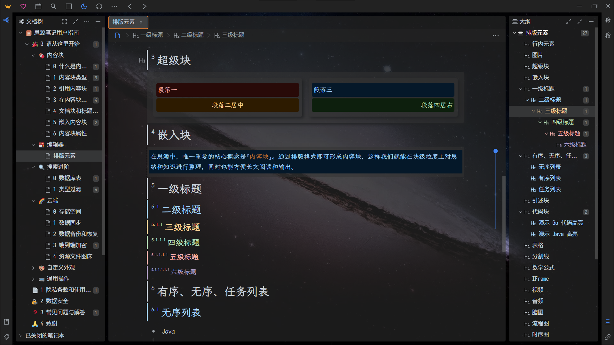

# 🌙Dark+

<center>


</center>

[思源笔记](https://github.com/siyuan-note/siyuan)的一款暗黑主题  
A dark theme of [SiYuan Note](https://github.com/siyuan-note/siyuan).

现已上架[思源笔记社区集市](https://github.com/siyuan-note/bazaar), 如果您需要订阅[思源笔记](https://github.com/siyuan-note/siyuan)增值服务，欢迎使用我的推荐码: **h0sc9rc**  
It is now on the shelves of the [Siyuan Notes Community Bazaar](https://github.com/siyuan-note/bazaar). If you need to subscribe to the value-added services of [siyuan note](https://github.com/siyuan-note/siyuan/blob/master/README_en_US.md), please use my referral code: **h0sc9rc**

## 预览 | PREVIEW



## 自定义配置 | CUSTOM CONFIG

1. 创建文件 `<工作空间>/data/widgets/custom.css`  
   Create a file `<workspace>/data/widgets/custom.css`
2. 在文件 `<工作空间>/data/widgets/custom.css` 中定义的值将覆盖 `<工作空间>/conf/appearance/themes/Dark+/style/module/config.css` 中对应的值  
   The value defined in file `<workspace>/data/widgets/custom.css` overwrites the corresponding value in file `<workspace>/conf/appearance/themes/Dark+/style/module/config.css`.

### 配置示例 | CONFIG EXAMPLE

```css
:root {
    /* 标题层级标记与标题之间宽度 */
    --custom-h-mark-blank: 4px;

    /* 标题层级标记 */
    --custom-h1-mark: "¹";
    --custom-h2-mark: "²";
    --custom-h3-mark: "³";
    --custom-h4-mark: "⁴";
    --custom-h5-mark: "⁵";
    --custom-h6-mark: "⁶";

    /* --custom-h1-mark: "₁";
    --custom-h2-mark: "₂";
    --custom-h3-mark: "₃";
    --custom-h4-mark: "₄";
    --custom-h5-mark: "₅";
    --custom-h6-mark: "₆"; */

    /* 标题序号缩放 | Title ordinal scaling */
    --custom-h-num-font-size: 50%;

    /* 子标题及其对应大纲颜色 | Subheadings and their corresponding outline colors */
    --custom-h1-color: var(--b3-theme-on-background);
    --custom-h2-color: var(--b3-card-info-color);
    --custom-h3-color: var(--b3-card-warning-color);
    --custom-h4-color: var(--b3-card-success-color);
    --custom-h5-color: var(--b3-card-error-color);
    --custom-h6-color: var(--custom-color-8-3);

    /* 块引用标记 | Block reference mark */
    /* --custom-quote-l: "「";
    --custom-quote-r: "」"; */

    /* 
     * ⸢: U+2E22
     * ⸥: U+2E25
     */
    --custom-quote-l: "⸢";
    --custom-quote-r: "⸥";

    /* 背景图片 | Background image */
    --custom-background-image: url("/appearance/themes/Dark+/images/background (05).jpg");

    /* 对话框背景图片 | Dialog background image */
    /* 暂未使用 | Not used yet */
    --custom-background-image-dialog: url("/appearance/themes/Dark+/images/background (01).jpg");

    /* 背景图片滤波器 | Background image filter */
    /* --custom-backdrop-filter: blur(16px); */
    --custom-backdrop-filter: none;

    /* 悬浮面板滤波器(引用预览, 菜单) | Hover panel filters (reference preview, menu)*/
    /* --custom-backdrop-popover-filter: blur(2px); */
    --custom-backdrop-popover-filter: none;

    /* 悬浮预览窗口最小高度 | The minimum height of the hover preview window */
    --custom-popover-min-height: 50%;

    /* 悬浮搜索菜单宽度 | The width of popover search menu */
    --custom-popover-search-width: auto;

    /* 功能面板间隔距离 | Function panel spacing distance */
    --custom-panel-distance: 8px;

    /* 功能面板分隔线补偿距离 | Function panel dividers compensate for distance
     * 需要设置为 --custom-panel-distance 的负值 | A negative value of --custom-panel-distance is required
     */
    --custom-separator-distance-compensation: -8px;

    /* 超级块内边距 | The inner margin of the superblock */
    --custom-block-padding: 8px;

    /* 圆角弧度 | Rounded arc */
    --custom-border-radius: 4px;

    /* 列表辅助线弧度 | Rounded arc of list guides line */
    --custom-list-guides-line-radius: 16px;

    /* 列表辅助线宽度 | The width of list guides line */
    --custom-list-guides-line-width: 2px;

    /* 列表辅助线与上层节点的接缝 | The seams between the list guides line and the upper layer nodes */
    --custom-list-guides-line-top: -4px;

    /* 列表辅助线与本层节点的接缝 | The seams between the list guides line and the local layer nodes */
    --custom-list-guides-line-right-t: calc(22px + 5em / 16);
    --custom-list-guides-line-right-u: calc(22px + 5em / 16);
    --custom-list-guides-line-right-o: calc(14px + 1em);

    /* 透明组件颜色 | Transparent component color */
    --custom-transparent-lighter: #3338;
    --custom-transparent-light: #222A;
    --custom-transparent: #222C;
    --custom-transparent-deep: #222D;
    --custom-transparent-deeper: #222E;

    /* 不透明的组件颜色 | Opaque component color */
    --custom-components-light: #444;
    --custom-components: #222;
    --custom-components-deep: #111;

    /* 左右菜单栏(功能坞)背景颜色 | Left and right menu bar (dock) background color */
    --custom-dock-left-background-color: var(--custom-transparent);
    --custom-dock-right-background-color: var(--custom-transparent);

    /* 顶部工具栏背景颜色 | The background color of the top toolbar */
    --custom-tool-bar-background-color: var(--custom-transparent);

    /* 编辑区背景颜色 | The background color of the edit area */
    --custom-editor-background-color: var(--custom-transparent);

    /* 编辑区标题栏背景颜色 | The background color of the edit area title bar */
    --custom-editor-title-bar-background-color: transparent;

    /* 编辑区导航栏(面包屑)背景颜色 | The background color of the edit area navigation bar (breadcrumbs) */
    --custom-editor-breadcrumb-bar-background-color: var(--custom-components);

    /* 编辑区页签栏背景颜色 | The background color of the  edit area tab bar */
    --custom-tab-bar-background-color: var(--custom-transparent);

    /* 弹出窗口背景颜色 | The background color of the popover */
    --custom-popover-background-color: var(--custom-editor-background-color);

    /* 弹出窗口标题栏背景颜色 | The background color of the popover title bar */
    --custom-popover-title-bar-background-color: var(--custom-editor-title-bar-background-color);

    /* 弹出窗口导航栏(面包屑)背景颜色 | The background color of the popover navigation bar (breadcrumbs) */
    --custom-popover-breadcrumb-bar-background-color: var(--custom-editor-breadcrumb-bar-background-color);


    /* iframe 块背景颜色 | The background color of iframe block */
    --custom-block-iframe-background-color: var(--custom-transparent);

    /* 代码块背景颜色 | The background color of code block */
    --custom-block-code-background-color: var(--custom-transparent-lighter);

    /* 嵌入块背景颜色 | The background color of embed block */
    --custom-block-embed-background-color: var(--custom-transparent-lighter);

    /* 引述块背景颜色 | The background color of quote block */
    --custom-block-quote-background-color: var(--custom-transparent-lighter);

    /* 超级块背景颜色 | The background color of super block */
    --custom-block-super-background-color: var(--custom-transparent-lighter);

    /* 表格块背景颜色 | The background color of table block */
    --custom-block-table-background-color: transparent;
    /* 表头 | thead */
    --custom-block-table-thead-background-color: var(--custom-components-light);
    /* 奇数行 | odd line */
    --custom-block-table-odd-background-color: var(--custom-transparent-lighter);
    /* 偶数行 | even line */
    --custom-block-table-even-background-color: var(--custom-transparent-light);


    /* 弹出功能菜单背景颜色 | The background color of the popover function menu */
    --custom-popover-function-menu-background-color: var(--custom-transparent-deep);

    /* 弹出搜索菜单背景颜色 | The background color of the popover search menu */
    --custom-popover-search-menu-background-color: var(--custom-transparent-deep);


    /* 鲜明颜色 | Striking color */
    --custom-striking-color: var(--b3-font-color12);

    /* 数学公式整体缩放比例 | The overall scale of the mathematical formula */
    --custom-math-size: 100%;

    /* 数学公式上下标缩放比例 | The mathematical formula superscript scaling */
    --custom-math-sub-size: 100%;

    /* 块引用标志颜色 | Block reference flag color */
    --custom-ref-mark-color: var(--b3-protyle-inline-link-color);

    /* 列表项聚焦颜色 | List item focus color */
    --custom-list-item-color: var(--b3-protyle-inline-link-color);

    /* 空行聚焦提示 | Blank line focus prompt */
    --custom-empty-focus-p: "´･-･)ﾉ㊫";
    --custom-empty-focus-c: "´･-･)ﾉ↹";
    --custom-empty-focus-t: "´･-･)ﾉ☑";
    --custom-empty-focus-u: "´･-･)ﾉ◉";
    --custom-empty-focus-o: "´･-･)ﾉ①";

    /* 空行提示 | Blank line prompt */
    --custom-empty-p: "这里是空的 (´･-･)ﾉ㊫";
    --custom-empty-c: "这里是空的 (´･-･)ﾉ↹";
    --custom-empty-t: "这里是空的 (´･-･)ﾉ☑";
    --custom-empty-u: "这里是空的 (´･-･)ﾉ◉";
    --custom-empty-o: "这里是空的 (´･-･)ﾉ①";

    /* 文档树匹配标题颜色(文档标题尾匹配) | Document tree match header color (document end-of-title match) */
    /* * */
    --custom-doctree-end-asterisk-color: var(--b3-card-success-color);
    /* # */
    --custom-doctree-end-sharp-color: var(--b3-card-info-color);
    /* ? */
    --custom-doctree-end-question-color: var(--b3-card-warning-color);
    /* ! */
    --custom-doctree-end-exclamation-color: var(--b3-card-error-color);

    /* 文档树匹配文档标题颜色(文档标题头匹配) | Document tree matches document title color (document header match) */
    /* * */
    --custom-doctree-begin-asterisk-color: var(--custom-color-9-3);
    /* # */
    --custom-doctree-begin-sharp-color: var(--custom-color-8-3);
    /* ? */
    --custom-doctree-begin-question-color: var(--custom-color-4-0);
    /* ! */
    --custom-doctree-begin-exclamation-color: var(--custom-color-6-0);
    /* @ */
    --custom-doctree-begin-at-color: var(--custom-color-5-0);
    /* . */
    --custom-doctree-begin-period-color: #0000;
}
```

## 介绍 | INTRODUCTION

- 在其他主题中引用本主题模块  
  Reference this theme modules in other themes.
  - 在 `<工作空间>/conf/appearance/themes/Dark+/theme.css` 文件中直接粘贴所需模块到其他主题的 `theme.css` 文件或 `custom.css` 文件中  
    Paste the desired module into `theme.css` file or `custom.css` file for another theme in the `<workspace>/conf/appearance/themes/Dark+/theme.css` file.
  - 在其他主题中引用本主题模块时, 自定义配置文件 `<工作空间>/data/widgets/custom.css` 同样有效  
    Custom configuration files `<workspace>/data/widgets/custom.css` also work when this theme modules were referenced in other theme modules.

## 计划 | TODO

- [ ] 介绍
  - [x] 自定义配置
    - [x] 教程
    - [x] 示例
  - [x] 在其他主题中引用样式
  - [x] 将所有的半透明背景颜色在配置中集中设置

## 开始 | START

### 自动安装 | AUTO INSTALL

该主题已在[思源笔记社区集市](https://github.com/siyuan-note/bazaar)上架, 可直接在集市中安装  
The theme has been put on the shelves at [SiYuan community bazaar](https://github.com/siyuan-note/bazaar) and can be installed directly in the Bazaar.

### 手动安装 | MANUAL INSTALL

在 [Releases](https://github.com/Zuoqiu-Yingyi/siyuan-theme-dark-plus/releases) 中下载发行包, 解压后放到思源笔记 `<工作空间>/conf/appearance/themes/` 目录下  
Download the release package in [Releases](https://github.com/Zuoqiu-Yingyi/siyuan-theme-dark-plus/releases), unzip it and place it in the `<workspace>/conf/appearance/themes/` directory of SiYuan Note.

## 参考 & 感谢 | REFERENCE & THANKS

| 作者 \| Author                                      | 项目 \| Project                                                                                                                                       | 许可证 \| License |
| :-------------------------------------------------- | :---------------------------------------------------------------------------------------------------------------------------------------------------- | :---------------- |
| **[Achuan-2](https://github.com/Achuan-2)**         | [Achuan-2/siyuan-themes-tsundoku-dark: a editor theme for siyuan note](https://github.com/Achuan-2/siyuan-themes-tsundoku-dark)                       | *Unknown*         |
| **[roeseth](https://github.com/roeseth)**           | [roeseth/Siyuan-Golden-Topaz-Refined: A ported Golen Topaz theme for Siyuan note with tweaks](https://github.com/roeseth/Siyuan-Golden-Topaz-Refined) | *Unknown*         |
| **[Morganwan90](https://github.com/Morganwan90)**   | [Morganwan90/Lightblue-siyuan-theme](https://github.com/Morganwan90/Lightblue-siyuan-theme)                                                           | *Unknown*         |
| **[Crowds21](https://github.com/Crowds21)**         | [Crowds21/Cliff-Light](https://github.com/Crowds21/Cliff-Light)                                                                                       | *Unknown*         |
| **[Zhangwuji](https://ld246.com/member/Zhangwuji)** | [希望能够增加根据大纲生成思维导图的功能](https://ld246.com/article/1640259008838/comment/1640304551938#:~:text=fontxiugaidark.rar)                    | *Unknown*         |
| **[Morganwan90](https://github.com/Morganwan90)**   | [Morganwan90/Darkblue-siyuan-theme](https://github.com/Morganwan90/Darkblue-siyuan-theme)                                                             | *Unknown*         |

注: 排序不分先后  
ps: Sort in no particular order.

## 更改日志 | CHANGE LOGS

[CHANGELOG](CHANGELOG.md)
