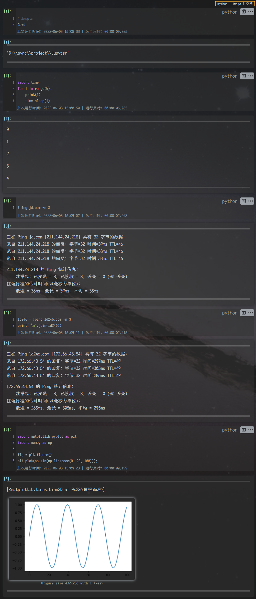

# 🌙Dark+

<center>

[](https://github.com/Zuoqiu-Yingyi/siyuan-theme-dark-plus/releases/latest)
[](https://github.com/Zuoqiu-Yingyi/siyuan-theme-dark-plus/releases/latest)
[](https://github.com/Zuoqiu-Yingyi/siyuan-theme-dark-plus/blob/main/LICENSE)
[](https://github.com/Zuoqiu-Yingyi/siyuan-theme-dark-plus/commits/main)


[](https://github.com/Zuoqiu-Yingyi/siyuan-theme-dark-plus/releases)<!-- ALL-CONTRIBUTORS-BADGE:START - Do not remove or modify this section -->
[](#贡献者介绍--contributor-introduction)
<!-- ALL-CONTRIBUTORS-BADGE:END -->

</center>

[思源笔记](https://github.com/siyuan-note/siyuan)的一款深色主题 (同时支持浅色模式, 没想到吧~)  
A dark theme (which also supports light mode, can you imagine that ~) of [SiYuan Note](https://github.com/siyuan-note/siyuan).

现已上架[思源笔记社区集市](https://github.com/siyuan-note/bazaar), 如果您喜欢本主题, 欢迎为本项目点亮一个⭐!  
It is now on the shelves of the [Siyuan Notes Community Bazaar](https://github.com/siyuan-note/bazaar). If you like this theme, welcome to light up ⭐ for this project!

## 预览 | PREVIEW


- 使用等宽字体时所有行内元素对齐  
  All inline elements are aligned when using a equal font.
- 行内元素样式适配所有字号  
  Inline element styles are adapted to all font sizes.


- 使用等宽字体时列表以 4 个半宽字符(2 个全宽字符)的宽度缩进  
  When using a equal font, list indentation is 4 half-width characters (2 full-width characters).
- 列表缩进样式适配所有字号  
  List indentation styles are adapted to all font sizes.

常用中西文 2:1 等宽字体: `仿宋`, `黑体`, `楷体`, `隶书`, `宋体`, `新宋体`, `幼圆`




## 介绍 | INTRODUCTION

### 介绍视频 | INTRODUCTION VIDEO

<iframe src="//player.bilibili.com/player.html?aid=980804170&bvid=BV1u44y1G7Y2&cid=581072653&page=1" scrolling="no" border="0" frameborder="no" framespacing="0" allowfullscreen="true"> </iframe>

感谢 [UserZYF](https://github.com/UserZYF) 朋友制作的视频  
Thanks to [UserZYF](https://github.com/UserZYF) for making the video.

同时推荐一下视频作者制作的精美主题  
Recommend the video author's beautiful theme.

- [UserZYF/Chrome-A4: 思源笔记的一个主题，chrome标签样式+A4纸张大小](https://github.com/UserZYF/Chrome-A4)
- [UserZYF/zhang-light: 思源笔记的一款主题](https://github.com/UserZYF/zhang-light)
- [UserZYF/zhang-dark: 一款思源笔记的夜间主题](https://github.com/UserZYF/zhang-dark)
- [UserZYF/blue-dog: 思源笔记的主题，蓝色](https://github.com/UserZYF/blue-dog)
- [UserZYF/green-elephant: 一款“绿象”配色的思源笔记主题](https://github.com/UserZYF/green-elephant)
- [UserZYF/min-verse: 思源笔记的一款主题](https://github.com/UserZYF/min-verse)

### 贡献者介绍 | CONTRIBUTOR INTRODUCTION

| 功能 \| Function                             | 贡献者 \| Contributor                   | 项目 \| Project                                                                                                                        |
| :------------------------------------------- | :-------------------------------------- | :------------------------------------------------------------------------------------------------------------------------------------- |
| 行内批注与注释<br/>inline comments and notes | [langzhou](https://github.com/langzhou) | [siyuan-note/siyuan-comment at main · langzhou/siyuan-note · GitHub](https://github.com/langzhou/siyuan-note/tree/main/siyuan-comment) |
| 列表脑图<br/>list mind maps                  | [royc01](https://github.com/royc01)     | [royc01/notion-theme: notion复刻](https://github.com/royc01/notion-theme)                                                              |

<!-- ALL-CONTRIBUTORS-LIST:START - Do not remove or modify this section -->
<!-- prettier-ignore-start -->
<!-- markdownlint-disable -->
<table>
  <tr>
    <td align="center"><a href="https://github.com/tswwe"><br /><sub><b>thxnder</b></sub></a><br /><a href="https://github.com/Zuoqiu-Yingyi/siyuan-theme-dark-plus/commits?author=tswwe" title="Code">💻</a></td>
    <td align="center"><a href="https://github.com/langzhou"><br /><sub><b>langzhou</b></sub></a><br /><a href="https://github.com/Zuoqiu-Yingyi/siyuan-theme-dark-plus/commits?author=langzhou" title="Code">💻</a></td>
    <td align="center"><a href="https://github.com/royc01"><br /><sub><b>royc01</b></sub></a><br /><a href="#ideas-royc01" title="Ideas, Planning, & Feedback">🤔</a> <a href="https://github.com/Zuoqiu-Yingyi/siyuan-theme-dark-plus/commits?author=royc01" title="Code">💻</a></td>
    <td align="center"><a href="https://github.com/UserZYF"><br /><sub><b>UserZYF</b></sub></a><br /><a href="#video-UserZYF" title="Videos">📹</a></td>
  </tr>
</table>

<!-- markdownlint-restore -->
<!-- prettier-ignore-end -->

<!-- ALL-CONTRIBUTORS-LIST:END -->

注: 该表格使用 [All Contributors · GitHub](https://github.com/all-contributors) 自动生成, 请到 [emoji key](https://allcontributors.org/docs/en/emoji-key) 查看贡献类型  
PS: The table is generated automatically using [All Contributors · GitHub](https://github.com/all-contributors), go to [emoji key](https://allcontributors.org/docs/en/emoji-key) to see the contribution type.

### 快捷键 | SHORTCUT KEYS

#### 主题快捷键 | THEME SHORTCUT KEYS

| 快捷键 \| Shortcut Key                                                             | 操作对象 \| Operational objectives                                                                                | 功能 \| Function                                                                                                            |
| :--------------------------------------------------------------------------------- | :---------------------------------------------------------------------------------------------------------------- | :-------------------------------------------------------------------------------------------------------------------------- |
| <kbd>鼠标中键</kbd><br/><kbd>Middle Mouse Button</kbd>                             | 整个窗口<br/>entire window                                                                                        | 在新窗口打开块或超链接<br/>open the block or hyperlink in a new window                                                      |
| <kbd>鼠标右键</kbd><br/><kbd>Right Mouse Button</kbd>                              | 文档右侧滑块 / 当前阅读进度标识<br/>slider on the right side of the document / current reading progress indicator | 跳转到文档上次浏览位置<br/>jump to where the document was last browsed                                                      |
| <kbd>Shift + 鼠标中键</kbd><br/><kbd>Shift + Middle Mouse Button</kbd>             | 整个窗口<br/>entire window                                                                                        | 在新窗口打开块并聚焦<br/>open the block in a new window and focus                                                           |
| <kbd>Alt + 鼠标中键</kbd><br/><kbd>Alt + Middle Mouse Button</kbd>                 | 整个窗口<br/>entire window                                                                                        | 在新窗口打开 Monaco 编辑器并编辑单击的内容<br/>open the Monaco Editor in a new window and edit the content                  |
| <kbd>Shift + Alt + 鼠标中键</kbd><br/><kbd>Shift + Alt + Middle Mouse Button</kbd> | 整个窗口<br/>entire window                                                                                        | 在新窗口打开 Monaco 编辑器并查看 markdown 源码<br/>open the Monaco Editor in a new window and edit the markdown source code |
| <kbd>Ctrl/⌘ + 鼠标滚轮</kbd><br/><kbd>Ctrl/⌘ + Mouse Wheel</kbd>                   | 整个窗口<br/>entire window                                                                                        | 调整编辑区字体大小<br/>adjust the edit area font size                                                                       |
| <kbd>Ctrl/⌘ + 鼠标中键</kbd><br/><kbd>Ctrl/⌘ + Middle Mouse Button</kbd>           | 超链接<br/>hyperlink                                                                                              | 设置自定义块属性<br/>set the custom block attributes                                                                        |
| <kbd>Ctrl/⌘ + 鼠标中键</kbd><br/><kbd>Ctrl/⌘ + Middle Mouse Button</kbd>           | 视频块/音频块/iframe块<br/>video block/audio block/iframe block                                                   | 将当前时间戳写入剪贴板<br/>write the current timestamp to the clipboard                                                     |
| <kbd>Ctrl/⌘ + 鼠标左键</kbd><br/><kbd>Ctrl/⌘ + Left Mouse Button</kbd>             | 视频块/音频块/iframe块<br/>video block/audio block/iframe block                                                   | 跳转到自定义块属性 `time` 所设置的时间点<br/>jump to the point in time set by the custom block attribute `time`             |
| <kbd>Ctrl/⌘ + 鼠标左键</kbd><br/><kbd>Ctrl/⌘ + Left Mouse Button</kbd>             | 挂件块/iframe块<br/>widget block/iframe block                                                                     | 重新加载块内容<br/>reload the block contents                                                                                |
| <kbd>Ctrl/⌘ + F1</kbd>                                                             | 当前文档<br/>current document                                                                                     | 渲染当前文档所有块的自定义样式<br/>render the custom style for all blocks in the current document                           |
| <kbd>Ctrl/⌘ + F5</kbd>                                                             | 整个窗口<br/>entire window                                                                                        | 重新加载整个窗口<br/>reload the entire window                                                                               |
| <kbd>Shift + Alt + B</kbd>                                                         | 整个窗口<br/>entire window                                                                                        | 启动/关闭页签纵向排列功能<br/>turn on/off the feature of tabs are arranged vertically                                       |
| <kbd>Shift + Alt + E</kbd>                                                         | 整个窗口<br/>entire window                                                                                        | 启动/关闭显示标记文本功能<br/>turn on/off the feature of displaying the mark text                                           |
| <kbd>Shift + Alt + F</kbd>                                                         | 整个窗口<br/>entire window                                                                                        | 启动/关闭专注模式 (折叠/展开功能面板)<br/>turn on/off the focus mode (collapse/expand the feature panels)                   |
| <kbd>Shift + Alt + G</kbd>                                                         | 整个窗口<br/>entire window                                                                                        | 启动/关闭列表辅助线(列表, 表格列表, 思维导图列表)<br/>turn on/off list guides (list, table list, mind map list)             |
| <kbd>Shift + Alt + I</kbd>                                                         | 整个窗口<br/>entire window                                                                                        | 启动/关闭反色模式<br/>turn on/off invert color mode                                                                         |
| <kbd>Shift + Alt + L</kbd>                                                         | 整个窗口<br/>entire window                                                                                        | 启动/关闭记录当前浏览位置功能<br/>turn on/off record the current browsing location                                          |
| <kbd>Shift + Alt + M</kbd>                                                         | 整个窗口<br/>entire window                                                                                        | 启动/关闭块菜单增强功能<br/>turn on/off block menu enhancement                                                              |
| <kbd>Shift + Alt + N</kbd>                                                         | 整个窗口<br/>entire window                                                                                        | 在新窗口打开光标所在块<br/>open the block where the cursor is located in a new window                                       |
| <kbd>Shift + Alt + R</kbd>                                                         | 整个窗口<br/>entire window                                                                                        | 使用网络背景图片<br/>use the web background images                                                                          |
| <kbd>Shift + Alt + T</kbd>                                                         | 整个窗口<br/>entire window                                                                                        | 启动/关闭打字机模式<br/>turn on/off typewriter mode                                                                         |
| <kbd>Shift + Alt + C</kbd>                                                         | 当前文档<br/>current document                                                                                     | 复制当前文档 markdown 全文至剪贴板<br/>copy the full markdown text of the current document to the clipboard                 |
| <kbd>Shift + Alt + X</kbd>                                                         | 当前文档<br/>current document                                                                                     | 剪切当前文档 markdown 全文至剪贴板<br/>cut the full markdown text of the current document to the clipboard                  |
| <kbd>Shift + Alt + D</kbd>                                                         | 当前文档<br/>current document                                                                                     | 删除当前文档全文<br/>delete the full content of the current documen                                                         |
| <kbd>Shift + Alt + ↑</kbd>                                                         | 当前文档<br/>current document                                                                                     | 折叠当前文档所有子标题<br/>collapse all sub-headings of the current document                                                |
| <kbd>Shift + Alt + ↓</kbd>                                                         | 当前文档<br/>current document                                                                                     | 展开当前文档所有子标题<br/>expand all sub-headings of the current document                                                  |
| <kbd>Ctrl/⌘ + Shift + Alt + R</kbd>                                                | 整个窗口<br/>entire window                                                                                        | 使用自定义背景图片<br/>use the custom background images                                                                     |
| <kbd>Ctrl/⌘ + Shift + Alt + N</kbd>                                                | 整个窗口<br/>entire window                                                                                        | 在新窗口打开光标所在块并聚焦<br/>open the block and focus where the cursor is located in a new window                       |
| <kbd>Ctrl/⌘ + Shift + Alt + L</kbd>                                                | 整个窗口<br/>entire window                                                                                        | 清除当前文档浏览位置记录<br/>clear the current document browsing location history                                           |
| <kbd>Ctrl/⌘ + Shift + Alt + O</kbd>                                                | 当前文档<br/>current document                                                                                     | 复制当前文档大纲为有序列表<br/>copy the current document outline as an ordered list                                         |
| <kbd>Ctrl/⌘ + Shift + Alt + U</kbd>                                                | 当前文档<br/>current document                                                                                     | 复制当前文档大纲为无序列表<br/>copy the current document outline as an unordered list                                       |
| <kbd>Ctrl/⌘ + Shift + Alt + T</kbd>                                                | 当前文档<br/>current document                                                                                     | 复制当前文档大纲为任务列表<br/>copy the current document outline as a task list                                             |

#### 编辑器快捷键 | EDITOR SHORTCUT KEYS

| 快捷键 \| Shortcut Key              | 功能 \| Function                                   |
| :---------------------------------- | :------------------------------------------------- |
| <kbd>Alt + Z</kbd>                  | 切换自动换行<br/>toggle word wrap                  |
| <kbd>Ctrl/⌘ + Alt + P</kbd>         | 窗口置顶与取消置顶<br/>window pin/unpin            |
| <kbd>Ctrl/⌘ + O</kbd>               | 在 vscode 中打开文件<br/>open file in VS Code      |
| <kbd>Ctrl/⌘ + Shift + O</kbd>       | 在 vscode 中打开目录<br/>open directory in VS Code |
| <kbd>Ctrl/⌘ + Alt + C</kbd>         | 复制当前窗口超链接<br/>copy link                   |
| <kbd>Ctrl/⌘ + Shift + Alt + C</kbd> | 复制当前窗口完整超链接<br/>copy full link          |

### 自定义块属性 | CUSTOM BLOCKS ATTRIBUTES

| 操作对象 \| Operational objectives                                                       | 属性名 \| Attribute Name | 属性值 \| Attribute Value                                                                                                                                                                                                                                                                | 功能 \| Function                                                                                |
| :--------------------------------------------------------------------------------------- | :----------------------- | :--------------------------------------------------------------------------------------------------------------------------------------------------------------------------------------------------------------------------------------------------------------------------------------- | :---------------------------------------------------------------------------------------------- |
| 所有块<br/>all types of blocks                                                           | `font-family`            | `等线`<br/>`方正舒体`<br/>`方正姚体`<br/>`仿宋`<br/>`黑体`<br/>`华文彩云`<br/>`华文仿宋`<br/>`华文琥珀`<br/>`华文楷体`<br/>`华文隶书`<br/>`华文宋体`<br/>`华文细黑`<br/>`华文新魏`<br/>`华文行楷`<br/>`华文中宋`<br/>`楷体`<br/>`隶书`<br/>`宋体`<br/>`微软雅黑`<br/>`新宋体`<br/>`幼圆` | 设置块所用字体族<br/>Sets the font family used by the block.                                    |
| 所有块<br/>all types of blocks                                                           | `render`                 | `danmaku`<br/>`弹幕`<br/>(可使用空格分隔多个属性值 \| You can separate multiple attribute values with spaces)                                                                                                                                                                            | 将块设置为滚动弹幕样式<br/>Set the block to the scrolling danmaku block style.                  |
| 所有块<br/>all types of blocks                                                           | `render`                 | `scroll`<br/>`滚屏`<br/>`滚动`<br/>(可使用空格分隔多个属性值 \| You can separate multiple attribute values with spaces)                                                                                                                                                                  | 为过长块设置纵向滚动条<br/>Set the vertical scroll bar for the overly long block.               |
| 所有块<br/>all types of blocks                                                           | `render`                 | `invert`<br/>`反色`<br/>(可使用空格分隔多个属性值 \| You can separate multiple attribute values with spaces)                                                                                                                                                                             | 将图片渲染为反色<br/>Render all images as inverted colors.                                      |
| 所有块<br/>all types of blocks                                                           | `mark`                   | `display`<br/>`显示`<br/>(可使用空格分隔多个属性值 \| You can separate multiple attribute values with spaces)                                                                                                                                                                            | 显示标记文本<br/>Display marked text.                                                           |
| 文档块<br/>document blocks                                                               | `location`               | 块 ID<br/>block ID                                                                                                                                                                                                                                                                       | 当前文档浏览位置<br/>The current document browsing location.                                    |
| 文档块<br/>document blocks                                                               | `background`             | `01` ~ `12`                                                                                                                                                                                                                                                                              | 设置文档的自定义背景图片<br/>Sets a custom background image for the document.                   |
| 文档块<br/>document blocks                                                               | `auto-num-h`             | `0`<br/>`false`<br/>`禁用`<br/>`关闭`<br/>                                                                                                                                                                                                                                               | 禁用该文档子标题的自动编号<br/>Disables automatic numbering of subheading in the document.      |
| 文档块<br/>document blocks                                                               | `auto-num-f`             | `图`<br/>`图片`<br/>`Fig.`<br/>`figure`<br/>`Figure`<br/>`FIGURE`                                                                                                                                                                                                                        | 启用该文档中图片的自动编号<br/>Enable automatic numbering of pictures in the document.          |
| 文档块<br/>document blocks                                                               | `auto-num-t`             | `表`<br/>`表格`<br/>`Tab.`<br/>`table`<br/>`Table`<br/>`TABLE`                                                                                                                                                                                                                           | 启用该文档中表格的自动编号<br/>Enable automatic numbering of tables in the document.            |
| 文档块<br/>document blocks                                                               | `render`                 | `id`<br/>(可使用空格分隔多个属性值 \| You can separate multiple attribute values with spaces)                                                                                                                                                                                            | 渲染每个块的块 ID<br/>Renders the ID of each block.                                             |
| 文档块<br/>document blocks                                                               | `render`                 | `href`<br/>(可使用空格分隔多个属性值 \| You can separate multiple attribute values with spaces)                                                                                                                                                                                          | 渲染超链接的 URL<br/>Renders the URL of each hyperlink.                                         |
| 文档块<br/>document blocks                                                               | `render`                 | `index`<br/>(可使用空格分隔多个属性值 \| You can separate multiple attribute values with spaces)                                                                                                                                                                                         | 渲染当前块在文档中的序号<br/>Renders the ordinal number of the current block in the document.   |
| 文档块<br/>document blocks                                                               | `render`                 | `content`<br/>(可使用空格分隔多个属性值 \| You can separate multiple attribute values with spaces)                                                                                                                                                                                       | 渲染输入框中的内容<br/>Renders the contents of the input box.                                   |
| 文档块<br/>document blocks                                                               | `render`                 | `outline`<br/>(可使用空格分隔多个属性值 \| You can separate multiple attribute values with spaces)                                                                                                                                                                                       | 渲染鼠标悬浮的块的轮廓<br/>Renders the outline of a hovering block.                             |
| 非文档块<br/>non-document blocks                                                         | `position`               | `top`<br/>`bottom`                                                                                                                                                                                                                                                                       | 将块固定到父容器顶部/底部<br/>Pin the block to the top/bottom of the parent container.          |
| 非文档块<br/>non-document blocks                                                         | `style`                  | css 样式<br/>CSS styles                                                                                                                                                                                                                                                                  | 设置块的自定义样式<br/>Set a custom style for the block.                                        |
| 非文档块<br/>non-document blocks                                                         | `title`                  | 任何值<br/>Any value                                                                                                                                                                                                                                                                     | 设置块标题<br/>Sets the title of the block.                                                     |
| 视频块/音频块/挂件块/iframe 块<br/>video blocks/audio blocks/widget blocks/iframe blocks | `width`                  | `100%`                                                                                                                                                                                                                                                                                   | 将 iframe 窗口宽度设置为文档宽度<br/>Sets the width of the iframe window to the document width. |
| 视频块/音频块<br/>video blocks/audio blocks                                              | `time`                   | `ss`<br/>`ss.ms`<br/>`mm:ss`<br/>`mm:ss.ms`<br/>`hh:mm:ss`<br/>`hh:mm:ss.ms`                                                                                                                                                                                                             | 时间戳<br/>Timestamp.                                                                           |
| 列表块 & 文档块<br/>list blocks & document blocks                                        | `type`                   | `table`<br/>`表格`<br/>(可使用空格分隔多个属性值 \| You can separate multiple attribute values with spaces)                                                                                                                                                                              | 列表渲染为表格<br/>Renders the list as a table.                                                 |
| 列表块 & 文档块<br/>list blocks & document blocks                                        | `type`                   | `脑图`<br/>`map`<br/>`导图`<br/>`mind-map`<br/>`思维导图`<br/>(可使用空格分隔多个属性值 \| You can separate multiple attribute values with spaces)                                                                                                                                       | 列表渲染为思维导图<br/>Renders the list as a mind map.                                          |
| 列表块<br/>list blocks                                                                   | `list-guides`            | 任何值<br/>Any value                                                                                                                                                                                                                                                                     | 启用动态列表辅助线<br/>Enable dynamic list guides.                                              |
| 表格块<br/>table blocks                                                                  | `table-width`            | `auto`<br/>`自动`<br/>(可使用空格分隔多个属性值 \| You can separate multiple attribute values with spaces)                                                                                                                                                                               | 启动表格内容自动换行<br/>Enable table content wraps.                                            |
| 表格块<br/>table blocks                                                                  | `table-width`            | `equal`<br/>`等宽`<br/>(可使用空格分隔多个属性值 \| You can separate multiple attribute values with spaces)                                                                                                                                                                              | 启动单元格等宽<br/>Enable equal cell.                                                           |
| 段落块<br/>paragraph blocks                                                              | `type`                   | `图标题`<br/>`表标题`<br/>`figure-title`<br/>`table-title`<br/>(使用空格分隔多个属性值 \| Separate multiple attribute values with spaces)                                                                                                                                                | 图标题/表标题自动计数<br/>Figure titles/table titles are counted automatically.                 |
| 段落块<br/>paragraph blocks                                                              | `writing-mode`           | `horizontal-tb`<br/>`vertical-rl`<br/>`vertical-lr`<br/>`sideways-rl`<br/>`sideways-lr`                                                                                                                                                                                                  | 如下表所示<br/>This is shown in the following table.                                            |


### 功能介绍 | FUNCTIONAL DESCRIPTION

- [Jupyter 模式 - 链滴](https://ld246.com/article/1654279855533)
- [记住当前文档浏览位置 - 链滴](https://ld246.com/article/1651720111393)
- [使用外部编辑器编辑笔记内容 - 链滴](https://ld246.com/article/1650694653631)
- [块自定义字体 - 链滴 - 链滴](https://ld246.com/article/1650339201591)
- [列表的表格视图与脑图视图 - 链滴](https://ld246.com/article/1650258401435)
- [多窗口功能 - 链滴 - 链滴](https://ld246.com/article/1649992440500)
- [使用网络背景图片 / 本地背景图片 - 链滴](https://ld246.com/article/1649386929319)
- [为笔记内 BiliBili/YouTube 视频创建时间戳 & 跳转到指定时间点 - 链滴](https://ld246.com/article/1648639553690)
- [复制当前文档的大纲至剪贴板 - 链滴](https://ld246.com/article/1648635517429)
- [为长代码块、长嵌入块与长表格添加块内滚动条 - 链滴](https://ld246.com/article/1647693571588)
- [打字机模式 - 链滴](https://ld246.com/article/1647182919087)
- [整篇文档的复制 / 剪切 (以 Markdown 格式) 与删除 - 链滴](https://ld246.com/article/1646806146533)
- [为笔记内视频块 / 音频块快速创建时间戳 - 链滴](https://ld246.com/article/1645210285263)
- [为笔记内视频块 / 音频块设置多个时间戳 - 链滴](https://ld246.com/article/1644814136903)
- [为笔记内视频块 / 音频块设置时间戳 - 链滴](https://ld246.com/article/1644759207850)

#### Jupyter 功能 | JUPYTER FEATURES

- 添加 Jupyter 服务对思源的信任
  1. 打开文件 `jupyter_lab_config.py` 或 `jupyter_notebook_config.py`
  2. 找到 `c.ServerApp.allow_origin` 或 `c.NotebookApp.allow_origin` 字段
  3. 将该字段设置为思源 `'location.origin'` 或 `'*'`
     - <kbd>Ctrl + Shift + I</kbd> 打开思源的开发者工具, 在控制台中输入 `location.origin` 后回车即可获得
  4. (可选, Token 认证方案) 找到 `c.ServerApp.token` 字段并将该字段设置为一个足够安全的值
  5. 保存文件并启动 jupyter 服务
- 登录 Jupyter 服务
  1. <kbd>文档块菜单</kbd> > <kbd>Jupyter</kbd> > <kbd>全局设置</kbd>
  2. 打开全局设置窗口
  3. 输入服务器 URL 并点击 <kbd>确定</kbd>
     - `http(s)://hostname(:port)`
  4. (可选, Cookie 认证方案) 点击 <kbd>测试</kbd> 链接跳转到登录页面并登录
  5. (可选, Cookie 认证方案) <kbd>Ctrl + Shift + I</kbd> 打开开发者工具, 获得 `Cookies`
     - 方案1: 在控制台输入 `document.cookie` 并从输出结果复制 `_xsrf` 字段
     - 方案2: 选择一个网络链接并从 HTTP 请求头的 `Cookies` 字段复制 `_xsrf` 字段
     - `_xsrf` 字段完整格式为 `_xsrf=d|xxxxxxxx|xxxxxxxxxxxxxxxxxxxxxxxxxxxxxxxx|dddddddddd`
       - `d`: 一个十进制数字
       - `x`: 一个十六进制数字
  6. 关闭 Jupyter 窗口并重新打开全局设置窗口
  7. 输入 `Cookies` 或 `Token` 并点击 <kbd>确定</kbd>
     - `Cookies` 认证方案仅适用于 Jupyter 服务与思源服务 URL host 相同的情况
       - 示例:
         - 思源服务 URL: `http://127.0.0.1:6806`
         - Jupyter 服务 URL: `http://127.0.0.1:8888`
  8. 关闭全局设置窗口
  9.  单击 <kbd>重新加载窗口</kbd> 按钮或 <kbd>Ctrl + F5</kbd> 刷新页面
- 建立会话
  1. <kbd>文档块菜单</kbd> > <kbd>Jupyter</kbd> > <kbd>文档设置</kbd>
  2. 打开文档设置窗口
  3. 选择内核, 输入 `会话名称` 与 `会话目录`, 单击 <kbd>新建</kbd>
  4. 单击 <kbd>重启</kbd> 按钮, 若没有弹窗则表示成功与服务器建立连接
  5. 单击 <kbd>连接</kbd> 按钮
  6. <kbd>F5</kbd> 刷新文档, 若文档右上角内核状态正确显示则表示会话建立并连接成功
- 运行代码
  - <kbd>代码块菜单</kbd> > <kbd>Jupyter</kbd> > <kbd>运行代码</kbd>
    - 输出结果会以 Markdown 格式渲染
  - <kbd>代码块菜单</kbd> > <kbd>Jupyter</kbd> > <kbd>运行代码 (转义输出结果)</kbd>
    - 输出结果所有符号使用 `\` 转义
- 关闭连接
  - <kbd>文档块菜单</kbd> > <kbd>Jupyter</kbd> > <kbd>关闭连接</kbd>
    - 不会关闭内核与会话
    - 重置运行序号
- 关闭内核
  1. <kbd>文档块菜单</kbd> > <kbd>Jupyter</kbd> > <kbd>文档设置</kbd>
  2. 单击 <kbd>关闭</kbd> 按钮
  3. <kbd>F5</kbd> 刷新文档, 若文档右上角内核状态显示 `No Kernel` 则表示关闭成功

---
- Add the Jupyter service's trust for Siyuan.
  1. Open file `jupyter_lab_config.py` or `jupyter_notebook_config.py`.
  2. Find `c.ServerApp.allow_origin` or `c.NotebookApp.allow_origin` field.
  3. Set the field to Siyuan `location.origin` or `*`.
     - <kbd>Ctrl + Shift + I</kbd> open Siyuan's developer tools, then enter `location.origin` in the console.
  4. (Optional, Token certification scheme) Find `c.ServerApp.token` field and set it to a sufficiently secure value.
  5. Save the file and start jupyter service.
- Log in to the jupyter service.
  1. <kbd>Doc Block Menu</kbd> > <kbd>Jupyter</kbd> > <kbd>Global Settings</kbd>
  2. Open the Global Settings Window.
  3. Enter the `Service Address` and click <kbd>OK</kbd> Button.
     - `http(s)://hostname(:port)`
  4. (Optional, Cookie certification scheme) Click <kbd>Test</kbd> link to jump to the login page and sign in.
  5. (Optional, Cookie certification scheme) <kbd>Ctrl + Shift + I</kbd> open jupyter's developer tools, get `Cookies`.
     - Scheme 1: input `document.cookie` to console and copy `_xsrf` field from output.
     - Scheme 2: select a HTTP request and copy `_xsrf` field from the HTTP header field `Cookies`
     - The style of `_xsrf` field full format is `_xsrf=d|xxxxxxxx|xxxxxxxxxxxxxxxxxxxxxxxxxxxxxxxx|dddddddddd`
       - `d`: A decimal number.
       - `x`: A hexadecimal number.
  6. Close the Jupyter window and reopen the Global Settings Window.
  7. Input `Cookies` or `Token` and click <kbd>OK</kbd> button.
     - `Cookies` authentication scheme only applies if the Jupyter service is the same as the SiYuan service URL host.
       - Examples:
         - SiYuan service URL: `http://127.0.0.1:6806`
         - Jupyter service URL: `http://127.0.0.1:8888`
  8. Close the Global Settings Window.
  9.  Click <kbd>Reload the Window</kbd> button or <kbd>Ctrl + F5</kbd> to reload window.
- Establish a session.
  1. <kbd>Doc Block Menu</kbd> > <kbd>Jupyter</kbd> > <kbd>Document Settings</kbd>
  2. Open the Document Settings Window.
  3. Select a kernel and input `Session Name'` 与 `Session Path`, then click <kbd>Create</kbd> buytton.
  4. Click <kbd>Restart</kbd> button, if there is no pop-up window, the connection to the server is successful.
  6. <kbd>F5</kbd> Refresh document, if the kernel state is displayed in the upper-right corner of the document, the session is established and connected successfully.
- Run code.
  - <kbd>Code Block Menu</kbd> > <kbd>Jupyter</kbd> > <kbd>Run Code</kbd>
    - The output is rendered in Markdown format.
  - <kbd>Code Block Menu</kbd> > <kbd>Jupyter</kbd> > <kbd>Run Code (Escape Output)</kbd>
    - The output are used `\` for all symbols to escape.
- Close connection.
  - <kbd>Doc Block Menu</kbd> > <kbd>Jupyter</kbd> > <kbd>Close Connection</kbd>
    - The operate well not close session and kernel.
    - The index number of blocks well be reset.
- Close kernel.
  1. <kbd>Doc Block Menu</kbd> > <kbd>Jupyter</kbd> > <kbd>Document Settings</kbd>
  2. Click <kbd>Close</kbd> button
  3. <kbd>F5</kbd> Refresh document, if the kernel state `No Kernel` is displayed in the upper-right corner of the document, the kernel is closed successfully.

#### 其他功能 | OTHER FEATURES

- 在其他主题中引用本主题模块  
  Reference this theme modules in other themes.
  - 在 `<工作空间>/conf/appearance/themes/Dark+/theme.css` 文件中直接粘贴所需模块到其他主题的 `theme.css` 文件或 `custom.css` 文件中  
    Paste the desired module into `theme.css` file or `custom.css` file for another theme in the `<workspace>/conf/appearance/themes/Dark+/theme.css` file.
  - 将 `<工作空间>/conf/appearance/themes/Dark+/theme.js` 文件复制到其他主题的目录下  
    Copy the `<workspace>/conf/appearance/themes/Dark+/theme.js` file to the directory of the other theme.
  - 在其他主题中引用本主题模块时, 自定义配置文件 `<工作空间>/data/widgets/custom.css` 与 `<工作空间>/data/widgets/custom.js` 依然生效  
    Custom configuration files `<workspace>/data/widgets/custom.css` and `<workspace>/data/widgets/custom.js` also work when this theme modules were referenced in other theme modules.

---

- 指向到思源 Web 静态文件服务目录的超链接显示图标  
  Hyperlinks to the Siyuan Web Static File Service directory displays icons.
  -  `assets/`: 资源文件目录 | Asset file directory
    - `data/**/assets/`
  -  `emojis/`: 表情文件目录 | Emoji file directory
    - `data/emojis/`
  -  `widgets/`: 挂件文件目录 | Widget file directory
    - `data/widgets/`
  -  `appearance/`: 外观文件目录 | Appearance file directory
    - `conf/appearance/`
  -  `export/`: 导出文件目录 | Export file directory
    - `temp/export/`
- 指向资源文件目录下常见文件的超链接显示图标  
  Hyperlinks to common files under the resource file directory display icons.
  - : PDF
  - : Word
  - : PowerPoint
  - : Excel
  - : Image
  - : Audio
  - : Video
  - : ZIP
  - : Other
- 指向第三方资源(`URL Scheme`)的超链接显示图标  
  Hyperlinks(`URL Scheme`) to the third-party resource displays icons.
  - : `bookxnotepro:` [BookxNote Pro](https://www.bookxnotepro.com/)
  - : `calibre:` [calibre - E-book management](https://calibre-ebook.com/)
  - : `es:` [Everything](https://www.voidtools.com/)
  - : `evernote:` [Evernote](https://www.evernote.com/)
  - : `file:` [RFC 8089 - The "file" URI Scheme](https://datatracker.ietf.org/doc/html/rfc8089)
  - : `http:` [RFC 2616 - Hypertext Transfer Protocol -- HTTP/1.1](https://datatracker.ietf.org/doc/html/rfc2616/)
  - : `https:` [RFC 2818 - HTTP Over TLS](https://datatracker.ietf.org/doc/html/rfc2818)
  - : `joplin:` [Joplin](https://joplinapp.org/)
  - : `lt:` [liquidtext](https://www.liquidtext.net/)
  - : `mailto:` [RFC 6068 - The 'mailto' URI Scheme](https://datatracker.ietf.org/doc/html/rfc6068)
  - : `marginnote3app:` [Marginnote](https://www.marginnote.com/)
  - : `obsidian:` [Obsidian](https://obsidian.md/)
  - : `onenote:` [OneNote](https://www.onenote.com/)
  - : `quicker:` [Quicker](https://getquicker.net/)
  - : `runpwsh:` `runcmd:` [url-run-command](https://github.com/Zuoqiu-Yingyi/url-run-command)
  - : `siyuan:` [思源笔记](https://b3log.org/siyuan/)
  - : `sm:` [Super Memory](https://www.super-memory.com/)
  - : `ticktick:` [TickTick](https://ticktick.com/)
  - : `vscode:` [Visual Studio Code](https://code.visualstudio.com/)
  - : `zotero:` [Zotero](https://www.zotero.org/)
- 使用 URL 参数 `id=<内容块 ID>` 从浏览器外跳转到 Web 端的指定块(必须已经打开至少一个页签)  
  Jump from outside the browser to a specified block on the web side using the URL parameter `id=<content block ID>` (at least one tab must already be open)
  - 示例: `http(s)://host:port/stage/build/desktop/?id=20220128124308-bancmue`  
    exanple: `http(s)://host:port/stage/build/desktop/?id=20220128124308-bancmue`
- 使用 <kbd>鼠标中键</kbd> 单击块/超链接/块引用在新窗口打开  
  Click on a block/link/block-reference to open a new window using the <kbd>Middle Mouse Button</kbd>.
- 使用 <kbd>鼠标右键</kbd> 单击文档右侧的滑块或当前阅读进度标识, 跳转到文档上次浏览位置  
  Click on a slider on the right side of the document or current reading progress indicator to jump to where the document was last browsed using the <kbd>Right Mouse Button</kbd>.
- 使用 <kbd>Shift + 鼠标中键</kbd> 单击块/超链接/块引用在新窗口打开并聚焦  
  Click on a block/link/block-reference to open a window and focus using the <kbd>Shift + Middle Mouse Button</kbd>.
- 使用 <kbd>Alt + 鼠标中键</kbd> 单击块/超链接/块引用在新窗口打开 [Monaco 编辑器](https://github.com/microsoft/monaco-editor)并编辑源代码  
  Click on a block/link/block-reference to open [Monaco Editor](https://github.com/microsoft/monaco-editor) in a new window and edit source code using the <kbd>Alt + Middle Mouse Button</kbd>.
- 使用 <kbd>Shift + Alt + 鼠标中键</kbd> 单击块在新窗口打开 [Monaco 编辑器](https://github.com/microsoft/monaco-editor)并查看指定块的 markdown 源码  
  Click on a block to open [Monaco Editor](https://github.com/microsoft/monaco-editor) in a new window and preview the markdown source code of document using the <kbd>Shift + Alt + Middle Mouse Button</kbd>.
    - 每次打开编辑器时都会更改文档的更新时间  
      Each time you open the editor, you change the update time of the document.
- 使用快捷键 <kbd>Ctrl/⌘ + 鼠标滚轮</kbd> 可以调整编辑区字体大小  
  Use the shortcut keys <kbd>Ctrl/⌘ + Mouse Wheel</kbd> to adjust the edit area font size.
- 使用超链接设置块属性  
  Use hyperlinks to set block attributes.
  - `超文本引用`: 指向想要设置块属性的块的超链接  
    `href`: A hyperlink to the block for which you want to set the block attributes.
    - 示例 | example: `siyuan://blocks/20220213230830-g1amobi`
  - `标题`: `json` 格式的一组键值对  
    `title`: A set of key-value pairs in `json` format.
    - 示例 | example: `{"memo": "timestamp", "custom-time": "00:00:01"}`
  - 使用快捷键 <kbd>Ctrl/⌘ + 鼠标中键</kbd> 单击超链接设置自定义块属性  
    Use the shortcut keys <kbd>Ctrl/⌘ + Middle Mouse Button</kbd> click the hyperlink to set the custom block attributes.
- 使用快捷键 <kbd>Ctrl/⌘ + 鼠标中键</kbd> 单击视频块/音频块将当前时间戳写入剪贴板  
  Use the shortcut keys <kbd>Ctrl/⌘ + Middle Mouse Button</kbd> click the video block or the audio block to write the current timestamp to the clipboard.
- 使用快捷键 <kbd>Ctrl/⌘ + 鼠标中键</kbd> 单击 iframe 块将自定义块属性 `time` 所设置的时间点格式化为时间戳并写入剪贴板  
  Use the shortcut keys <kbd>Ctrl/⌘ + Middle Mouse Button</kbd> click the iframe block to format the point in time set by the custom block attribute `time` as a timestamp and writes it to the clipboard.
- 使用快捷键 <kbd>Ctrl/⌘ + 鼠标左键</kbd> 单击视频块/音频块/iframe 块跳转到自定义块属性 `time` 所设置的时间点  
  Use the shortcut keys <kbd>Ctrl/⌘ + Left Mouse Button</kbd> click the video block, the audio block or iframe block to jump to the point in time set by the custom block attribute `time`.
- 使用快捷键 <kbd>Ctrl/⌘ + 鼠标左键</kbd> 单击 Iframe 块或挂件块重新加载块内容  
  Use the shortcut keys <kbd>Ctrl/⌘ + Left Mouse Button</kbd> click the iframe block or the widget block to reload the block contents.
- 使用快捷键 <kbd>Ctrl/⌘ + F5</kbd> 重新加载整个窗口  
  Use the shortcut key <kbd>Ctrl/⌘ + F5</kbd> to reload the entire window.
- 使用快捷键 <kbd>Shift + Alt + B</kbd> 启动/关闭页签纵向排列功能  
  Use the shortcut key <kbd>Shift + Alt + B</kbd> to turn on/off the feature of tabs are arranged vertically.
- 使用快捷键 <kbd>Shift + Alt + E</kbd> 启动/关闭显示标记文本功能  
  Use the shortcut key <kbd>Shift + Alt + E</kbd> to turn on/off the feature of displaying the mark text.
- 使用快捷键 <kbd>Shift + Alt + F</kbd> 启动/关闭专注模式 (折叠/展开功能面板)  
  Use the shortcut key <kbd>Shift + Alt + F</kbd> to turn on/off the focus mode (collapse/expand the feature panels).
- 使用快捷键 <kbd>Shift + Alt + I</kbd> 启动/关闭反色模式  
  Use the shortcut key <kbd>Shift + Alt + I</kbd> to turn on/off invert color mode.
- 使用快捷键 <kbd>Shift + Alt + G</kbd> 启动/关闭列表辅助线(列表, 表格列表, 思维导图列表)  
  Use the shortcut key <kbd>Shift + Alt + G</kbd> to turn on/off list guides (list, table list, mind map list).
- 使用快捷键 <kbd>Shift + Alt + L</kbd> 启动/关闭记录当前浏览位置功能  
  Use the shortcut key <kbd>Shift + Alt + L</kbd> to turn on/off record the current browsing location.
  - 开启后可以使用 <kbd>鼠标右键</kbd> 单击文档右侧的滑块, 跳转到文档上次浏览位置  
    You can click on a slider on the right side of the document to jump to where the document was last browsed using the <kbd>Right Mouse Button</kbd> when turned on.
- 使用快捷键 <kbd>Shift + Alt + M</kbd> 启动/关闭块菜单增强功能  
  Use the shortcut key <kbd>Shift + Alt + M</kbd> to turn on/off block menu enhancement.
- 使用快捷键 <kbd>Shift + Alt + N</kbd> 在新窗口打开光标所在块  
  Use the shortcut key <kbd>Shift + Alt + N</kbd> to open the block where the cursor is located in a new window.
- 使用快捷键 <kbd>Shift + Alt + R</kbd> 使用网络背景图片  
  Use the shortcut key <kbd>Shift + Alt + R</kbd> to use the web background images.
  - 图片来源: [Beautiful Free Images & Pictures | Unsplash](https://unsplash.com/)  
    Image source: [Beautiful Free Images & Pictures | Unsplash](https://unsplash.com/)
- 使用快捷键 <kbd>Shift + Alt + T</kbd> 启动/关闭打字机模式  
  Use the shortcut key <kbd>Shift + Alt + T</kbd> to turn on/off typewriter mode.
- 使用快捷键 <kbd>Shift + Alt + C</kbd> 复制当前文档 markdown 全文至剪贴板  
  Use the shortcut keys <kbd>Shift + Alt + C</kbd> to copy the full markdown text of the current document to the clipboard.
- 使用快捷键 <kbd>Shift + Alt + X</kbd> 剪切当前文档 markdown 全文至剪贴板  
  Use the shortcut keys <kbd>Shift + Alt + X</kbd> to cut the full markdown text of the current document to the clipboard.
- 使用快捷键 <kbd>Shift + Alt + D</kbd> 删除当前文档全部内容  
  Use the shortcut keys <kbd>Shift + Alt + D</kbd> to delete the full content of the current documen.
- 使用快捷键 <kbd>Shift + Alt + ↑</kbd> 折叠当前文档所有子标题  
  Use the shortcut keys <kbd>Shift + Alt + ↑</kbd> to collapse all sub-headings of the current document.
- 使用快捷键 <kbd>Shift + Alt + ↓</kbd> 展开当前文档所有子标题  
  Use the shortcut keys <kbd>Shift + Alt + ↓</kbd> to expand all sub-headings of the current document.
- 使用快捷键 <kbd>Ctrl/⌘ + Shift + Alt + R</kbd> 使用自定义背景图片  
  Use shortcut key <kbd>Ctrl/⌘ + Shift + Alt + R</kbd> to use the custom background images.
- 使用快捷键 <kbd>Ctrl/⌘ + Shift + Alt + N</kbd> 在新窗口打开光标所在块并聚焦  
  Use shortcut key <kbd>Ctrl/⌘ + Shift + Alt + N</kbd> to open the block where the cursor is located in a new window.
- 使用快捷键 <kbd>Ctrl/⌘ + Shift + Alt + L</kbd> 清除当前文档浏览位置记录  
  Use shortcut key <kbd>Ctrl/⌘ + Shift + Alt + L</kbd> to clear the current document browsing location history.
- 使用快捷键 <kbd>Ctrl/⌘ + Shift + Alt + O</kbd> 复制当前文档大纲为有序列表  
  Use shortcut key <kbd>Ctrl/⌘ + Shift + Alt + O</kbd> to copy the current document outline as an ordered list.
- 使用快捷键 <kbd>Ctrl/⌘ + Shift + Alt + U</kbd> 复制当前文档大纲为无序列表  
  Use shortcut key <kbd>Ctrl/⌘ + Shift + Alt + U</kbd> to copy the current document outline as an unordered list.
- 使用快捷键 <kbd>Ctrl/⌘ + Shift + Alt + T</kbd> 复制当前文档大纲为任务列表  
  Use shortcut key <kbd>Ctrl/⌘ + Shift + Alt + T</kbd> to copy the current document outline as a task list.
- 块自定义属性
  Block custom attributes.
  - `font-family`: 属性名 | key
    - 适用于所有块 | Applies to all blocks
    - 字体 | font
    - 属性值: 字体名称  
      Attribute value: Font name
      - `等线`
      - `方正舒体`
      - `方正姚体`
      - `仿宋`
      - `黑体`
      - `华文彩云`
      - `华文仿宋`
      - `华文琥珀`
      - `华文楷体`
      - `华文隶书`
      - `华文宋体`
      - `华文细黑`
      - `华文新魏`
      - `华文行楷`
      - `华文中宋`
      - `楷体`
      - `隶书`
      - `宋体`
      - `微软雅黑`
      - `新宋体`
      - `幼圆`
  - `render`: 属性名 | key
    - `danmaku` / `弹幕`: 属性值 | value
      - 适用于所有块 | Applies to all blocks
        - 若为文档块, 将当前文档中所有最顶级的块设置为滚动弹幕样式  
          If the block is a document block, set all the top-level blocks in the current document to the scrolling danmaku block style.
        - 若为非文档块, 将当前块设置为滚动弹幕样式  
          If the block is not a document block, set the current block to the scrolling danmaku block style.
      - 将块设置为滚动弹幕样式  
        Set the block to the scrolling danmaku block style.
    - `scroll` / `滚屏` / `滚动`: 属性值 | value
      - 适用于所有块 | Applies to all blocks
        - 若为文档块, 为当前文档中所有最顶级的块添加滚动条  
          If the block is a document block, add scroll bars to all the top-level blocks in the current document.
        - 若为非文档块, 为当前块添加滚动条  
          If the block is not a document block, add a scroll bar to the current block.
    - `invert` / `反色`: 属性值 | value
      - 适用于所有块 | Applies to all blocks
        - 若为文档块, 将当前文档中所有图片渲染为反色  
          If the block is a document block, render all images in the current document as inverted colors.
        - 若为非文档块, 将当前块中所有图片渲染为反色  
          If the block is not a document block, render all images in the current block as inverted colors.
  - `mark`: 属性名 | key
    - `display` / `显示`: 属性值 | value
    - 适用于所有块 | Applies to all blocks
    - 显示标记文本 | Display marked text.
  - `location`: 属性名 | key
    - 块 ID/block ID: 属性值 | value
    - 适用于文档块 | Applies to document blocks
    - 记录当前文档浏览位置 | Records the current document browsing location.
    - 使用 <kbd>鼠标右键</kbd> 单击文档右侧的滑块, 可以跳转到当前文档浏览位置  
      You can click on a slider on the right side of the current document to jump to where the document was last browsed using the <kbd>Right Mouse Button</kbd>.
  - `background`: 属性名 | key
    - `01` ~ `12`: 属性值 | value
    - 适用于文档块 | Applies to document blocks
    - 设置文档的自定义背景图片 | Sets a custom background image for the document.
  - `auto-num-h`: 属性名 | key
    - `0` / `false` / `禁用` / `关闭`: 属性值 | value
    - 适用于文档块 | Applies to document blocks
    - 禁用该文档子标题的自动编号 | isables automatic numbering of subheading in the document.
  - `auto-num-f`: 属性名 | key
    - `图`: 属性值 | value
    - `图片`: 属性值 | value
    - `Fig.`: 属性值 | value
    - `figure`: 属性值 | value
    - `Figure`: 属性值 | value
    - `FIGURE`: 属性值 | value
    - 适用于文档块 | Applies to document blocks
    - 启用该文档中图片的自动编号 | Enable automatic numbering of pictures in the document.
  - `auto-num-t`: 属性名 | key
    - `表`: 属性值 | value
    - `表格`: 属性值 | value
    - `Tab.`: 属性值 | value
    - `table`: 属性值 | value
    - `Table`: 属性值 | value
    - `TABLE`: 属性值 | value
    - 适用于文档块 | Applies to document blocks
    - 启用该文档中表格的自动编号 | Enable automatic numbering of tables in the document.
  - `render`: 属性名 | key
    - `id`: 属性值 | value
      - 渲染每个块的块 ID | Renders the ID of each block.
    - `index`: 属性值 | value
      - 渲染当前块在文档中的序号 | Renders the ordinal number of the current block in the document.
    - `content`: 属性值 | value
      - 渲染输入框中的内容 | Renders the contents of the input box.
    - `outline`: 属性值 | value
      - 渲染鼠标悬浮的块的轮廓 | Renders the outline of a hovering block.
    - 适用于文档块 | Applies to document blocks
  - `position`: 属性名 | key
    - `top`: 属性值 | value
      - 将块固定到父容器顶部 | Pin the block to the top of the parent container.
    - `bottom`: 属性值 | value
      - 将块固定到父容器底部 | Pin the block to the bottom of the parent container.
  - `style`: 属性名 | key
    - 适用于所有块 | Applies to all blocks
    - 块样式 | block style
    - 设置后单击 <kbd>确认</kbd> 按钮将该自定义属性设置为块样式属性  
      After setting, click the <kbd>Confirm</kbd> button to set the custom attribute to a block style attribute.
  - `title`: 属性名 | key
    - 适用于所有块 | Applies to all blocks
    - 在块的上方设置块标题 | Set the block title above the block.
  - `width`: 属性名 | key
    - `100%`: 属性值 | value
      - 适用于视频块/音频块/挂件块/iframe 块 | Applies to video blocks/audio blocks/widget blocks/iframe blocks.
      - 将 iframe 窗口宽度设置为文档宽度 | Sets the width of the iframe window to the document width.
  - `time`: 属性名 | key
    - `<时间戳|timestamp>`: 属性值 | value
      - 适用于视频块/音频块 | Applies to video blocks and audio blocks
      - 格式 | format
        - `ss`: `ss >= 0`
        - `ss.ms`: `ss >= 0 && ms >= 0`
        - `mm:ss`: `mm >= 0 && 0 <= ss <= 59`
        - `mm:ss.ms`: `mm >= 0 && 0 <= ss <= 59 && ms >= 0`
        - `hh:mm:ss`: `hh >= 0 && 0 <= mm <= 59 && 0 <= ss <= 59`
        - `hh:mm:ss.ms`: `hh >= 0 && 0 <= mm <= 59 && 0 <= ss <= 59 && ms >= 0`
      - 在视频块/音频块中设置该自定义属性后, 按住 <kbd>Ctrl/⌘</kbd> 后单击视频/音频块可以跳转到该属性所设置的时间戳  
        After you set this custom attribute in a video/audio block, clicking the video/audio block while <kbd>ctrl/⌘-down</kbd> jumps to the point in time.
  - `type`: 属性名 | key
    - `表格` / `title`: 属性值 | value
      - 适用于列表块与文档块 | Applies to list blocks and document blocks
      - 列表渲染为表格 | Renders the list as a table
      - 需要在列表项内纵向排版时, 需要在列表项中插入一个容器块(引述块, 超级块)  
        Please insert a container block (quote block, super block) in list item when it need to lay out vertically.
      - 详情请参考 [土法列表表格 · 语雀](https://www.yuque.com/siyuannote/docs/yev84m)  
        For details, please refer to [Soil Law List Table - Yuque](https://www.yuque.com/siyuannote/docs/yev84m).
    - `脑图` / `导图` / `思维导图` / `map` / `mind-map`: 属性值 | value
      - 适用于列表块与文档块 | Applies to list blocks and document blocks
      - 列表渲染为思维导图 | Renders the list as a mind-map
      - 需要在列表项内纵向排版时, 需要在列表项中插入一个容器块(引述块, 超级块)  
        Please insert a container block (quote block, super block) in list item when it need to lay out vertically.
    - `图标题` 或 `表标题` | `figure-title` or `table-title`: 属性值 | value
      - 适用于段落块 | Applies to paragraph blocks
      - 图标题/表标题自动计数 | Figure titles/table titles are counted automatically
  - `list-guides`: 属性名 | key
    - 适用于列表块 | Applies to list blocks
    - 属性值可以设置为任意字符(不可为空)  
      The attribute value can be set to any character(not nullable).
    - 启用动态列表辅助线 | Enable dynamic list guides
  - `table-width`: 属性名 | key
    - 适用于表格块 | Applies to table blocks
    - 设置表格宽度样式 | Sets the table width style.
    - `auto` / `自动`: 属性值 | value
      - 表格宽度自动跟随文档宽度变化  
        The table width automatically follows the document width.
    - `equal` / `等宽`: 属性值 | value
      - 单元格等宽  
        Cell is equal width.
  - `writing-mode`: 属性名 | key
    - 适用于所有块 | Applies to all blocks
    - 文本排版模式 | text layout mode
    - 详情请参考: [writing-mode - CSS（层叠样式表） | MDN](https://developer.mozilla.org/zh-CN/docs/Web/CSS/writing-mode)  
      For details, please refer to [writing-mode - CSS: Cascading Style Sheets | MDN](https://developer.mozilla.org/en-US/docs/Web/CSS/writing-mode).
    - 属性值 | attribute value
      - `horizontal-tb`
        - (默认)对于左对齐(ltr)文本，内容从左到右水平流动。对于右对齐(rtr)文本，内容从右到左水平流动。下一水平行位于上一行下方。  
          For ltr scripts, content flows horizontally from left to right. For rtl scripts, content flows horizontally from right to left. The next horizontal line is positioned below the previous line.
      - `vertical-rl`
        - 对于左对齐(ltr)文本，内容从上到下垂直流动，下一垂直行位于上一行左侧。对于右对齐(rtr)文本，内容从下到上垂直流动，下一垂直行位于上一行右侧。  
          For ltr scripts, content flows vertically from top to bottom, and the next vertical line is positioned to the left of the previous line. For rtl scripts, content flows vertically from bottom to top, and the next vertical line is positioned to the right of the previous line.
      - `vertical-lr`
        - 对于左对齐(ltr)文本，内容从上到下垂直流动，下一垂直行位于上一行右侧。对于右对齐(rtr)文本，内容从下到上垂直流动，下一垂直行位于上一行左侧。  
          For ltr scripts, content flows vertically from top to bottom, and the next vertical line is positioned to the right of the previous line. For rtl scripts, content flows vertically from bottom to top, and the next vertical line is positioned to the left of the previous line.
      - `sideways-rl`
        - 仅在 Filefox 中支持 | Only supported in Filefox.
        - 对于左对齐(ltr)文本，内容从下到上垂直流动。对于右对齐(rtr)文本，内容从上到下垂直流动。所有字形（即使是垂直文本中的字形）都朝向右侧。 (默认样式顺时针旋转 90°)  
          For ltr scripts, content flows vertically from bottom to top. For rtl scripts, content flows vertically from top to bottom. All the glyphs, even those in vertical scripts, are set sideways toward the right.
      - `sideways-lr`
        - 仅在 Filefox 中支持 | Only supported in Filefox.
        - 对于左对齐(ltr)文本，内容从上到下垂直流动。对于右对齐(rtr)文本，内容从下到上垂直流动。所有字形（即使是垂直文本中的字形）都朝向左侧。 (默认样式逆时针旋转 90°)  
          For ltr scripts, content flows vertically from top to bottom. For rtl scripts, content flows vertically from bottom to top. All the glyphs, even those in vertical scripts, are set sideways toward the left.
  - 其他自定义样式  
    Other custom attributes.
    - 这些样式不会自动加载  
      These styles are not loaded automatically.
    - 将自定义样式名添加到 `<工作空间>/data/widgets/custom.js` 的 `custom.styles`  
      Add the custom style name to `custom.styles` in `<workspace>/data/widgets/custom.js`.
    - 在块的自定义属性中添加自定义样式名与样式值  
      Add custom style names and style values to the block's custom attributes.
    - 使用快捷键 <kbd>Ctrl + F1 / ⌘ + F1</kbd> 渲染当前所有块的自定义样式  
      Use the hot key <kbd>Ctrl + F1 / ⌘ + F1</kbd> to render the custom style of all current blocks.

## 自定义配置 | CUSTOM CONFIG

| 自定义配置文件 \| Custom configuration files          | 说明 \| Product                                                                                                                                                                                                                                                |
| :---------------------------------------------------- | :------------------------------------------------------------------------------------------------------------------------------------------------------------------------------------------------------------------------------------------------------------- |
| `<工作空间(workspace)>/data/widgets/custom.js`        | 主题功能配置选项, 覆盖 `<工作空间>/conf/appearance/themes/Dark+/style/module/config.js` 中对应的值<br/>Theme feature configuration, which overwrites the corresponding value in file `<workspace>/conf/appearance/themes/Dark+/style/module/config.js`         |
| `<工作空间(workspace)>/data/widgets/custom.css`       | 主题共用样式配置, 覆盖 `<工作空间>/conf/appearance/themes/Dark+/style/module/config.css` 中对应的值<br/>Themes share style configuration, which overwrites the corresponding value in file `<workspace>/conf/appearance/themes/Dark+/style/module/config.css`  |
| `<工作空间(workspace)>/data/widgets/custom-light.css` | 主题浅色样式配置, 覆盖 `<工作空间>/conf/appearance/themes/Dark+/style/color/light.css` 中对应的值<br/>Theme light color style configuration, which overwrites the corresponding value in file `<workspace>/conf/appearance/themes/Dark+/style/color/light.css` |
| `<工作空间(workspace)>/data/widgets/custom-dark.css`  | 主题深色样式配置, 覆盖 `<工作空间>/conf/appearance/themes/Dark+/style/color/dark.css` 中对应的值<br/>Theme dark color style configuration, which overwrites the corresponding value in file `<workspace>/conf/appearance/themes/Dark+/style/color/dark.css`    |

### 配置示例 | CONFIG EXAMPLE

#### custom.js

```js
/**
 * 文件路径 | File Path
 *    <工作空间>/data/widgets/custom.js
 *    <workspace>/data/widgets/custom.js
 * 示例功能 | Example function:
 *    自定义背景图片序列
 *        示例中浅色背景图片的目录为 <工作空间>/data/assets/images/background-light
 *        示例中深色背景图片的目录为 <工作空间>/data/assets/images/background-dark
 *    Custom background image list
 *        The directory of the light background image in the example is <workspace>/data/assets/images/background-light
 *        The directory of the dark background image in the example is <workspace>/data/assets/images/background-dark
 */

export const config = {
    theme: {
        background: {
            image: {
                custom: {
                    random: false,
                    default: true,
                    light: [
                        '/assets/images/background-light/background-1.png',
                        '/assets/images/background-light/background-2.png',
                        '/assets/images/background-light/background-3.png',
                        '/assets/images/background-light/background-4.png',
                        '/assets/images/background-light/background-5.png',
                    ],
                    dark: [
                        '/assets/images/background-dark/background-1.png',
                        '/assets/images/background-dark/background-2.png',
                        '/assets/images/background-dark/background-3.png',
                        '/assets/images/background-dark/background-4.png',
                        '/assets/images/background-dark/background-5.png',
                    ],
                },
            },
        },
    },
}

```

更多配置项请参考 [config.js](./script/module/config.js)  
For more configuration items, see [config.js](./script/module/config.js).

#### custom.css

```css
/**
 * 文件路径 | File Path
 *    <工作空间>/data/widgets/custom.css
 *    <workspace>/data/widgets/custom.css
 * 示例功能 | Example function:
 *    自定义空行提示文字
 *    Custom the blank line prompt text
 */

:root {
    /* 空行提示 | Blank line prompt */
    --custom-empty-p: "这里是空的 (´･-･)ﾉ㊫";
    --custom-empty-c: "这里是空的 (´･-･)ﾉ↹";
    --custom-empty-t: "这里是空的 (´･-･)ﾉ☑";
    --custom-empty-u: "这里是空的 (´･-･)ﾉ◉";
    --custom-empty-o: "这里是空的 (´･-･)ﾉ①";
}

```

更多配置项请参考 [config.css](./style/module/config.css)  
For more configuration items, see [config.css](./style/module/config.css).

#### custom-light.css

```css
/**
 * 文件路径 | File Path
 *    <工作空间>/data/widgets/custom-light.css
 *    <workspace>/data/widgets/custom-light.css
 * 示例功能 | Example function:
 *    自定义默认浅色主题背景图片
 *        示例中浅色背景图片的路径为
 *            <工作空间>/data/widgets/background-light.png
 *            <工作空间>/data/widgets/background-light-dialog.png
 *    Custom default light theme background image
 *        The path of the light background image in the example is
 *            <workspace>/data/widgets/background-light.png
 *            <workspace>/data/widgets/background-light-dialog.png
 */

:root {
    /* 浅色主题默认背景图片 | default background image for light color theme */
    --custom-background-image: url("/widgets/background-light.png");

    /* 浅色主题默认对话框背景图片 | default dialog background image for light color theme */
    --custom-background-image-dialog: url("/widgets/background-light-dialog.png");
}

```

更多配置项请参考 [config.css](./style/module/config.css) 与 [light.css](./style/color/light.css)  
For more configuration items, see [config.css](./style/module/config.css) and [light.css](./style/color/light.css).

#### custom-dark.css

```css
/**
 * 文件路径 | File Path
 *    <工作空间>/data/widgets/custom-dark.css
 *    <workspace>/data/widgets/custom-dark.css
 * 示例功能 | Example function:
 *    自定义默认深色主题背景图片
 *        示例中深色背景图片的路径为
 *            <工作空间>/data/widgets/background-dark.png
 *            <工作空间>/data/widgets/background-dark-dialog.png
 *    Custom default dark theme background image
 *        The path of the dark background image in the example is
 *            <workspace>/data/widgets/background-dark.png
 *            <workspace>/data/widgets/background-dark-dialog.png
 */

:root {
    /* 深色主题默认背景图片 | default background image for dark color theme */
    --custom-background-image: url("/widgets/background-dark.png");

    /* 深色主题默认对话框背景图片 | default dialog background image for dark color theme */
    --custom-background-image-dialog: url("/widgets/background-dark-dialog.png");
}

```

更多配置项请参考 [config.css](./style/module/config.css) 与 [dark.css](./style/color/dark.css)  
For more configuration items, see [config.css](./style/module/config.css) and [dark.css](./style/color/dark.css).

## 开始 | START

### 自动安装 | AUTO INSTALL

该主题已在[思源笔记社区集市](https://github.com/siyuan-note/bazaar)上架, 可直接在集市中安装  
The theme has been put on the shelves at [SiYuan community bazaar](https://github.com/siyuan-note/bazaar) and can be installed directly in the Bazaar.

### 手动安装 | MANUAL INSTALL

在 [Releases](https://github.com/Zuoqiu-Yingyi/siyuan-theme-dark-plus/releases) 中下载发行包, 解压后放到思源笔记 `<工作空间>/conf/appearance/themes/` 目录下  
Download the release package in [Releases](https://github.com/Zuoqiu-Yingyi/siyuan-theme-dark-plus/releases), unzip it and place it in the `<workspace>/conf/appearance/themes/` directory of SiYuan Note.

## 参考 & 感谢 | REFERENCE & THANKS

| 作者 \| Author                                      | 项目 \| Project                                                                                                                                       | 许可证 \| License                                                                              |
| :-------------------------------------------------- | :---------------------------------------------------------------------------------------------------------------------------------------------------- | :--------------------------------------------------------------------------------------------- |
| **[Achuan-2](https://github.com/Achuan-2)**         | [Achuan-2/siyuan-themes-tsundoku-dark: a editor theme for siyuan note](https://github.com/Achuan-2/siyuan-themes-tsundoku-dark)                       | *[GPL-3.0 license](https://github.com/Achuan-2/siyuan-themes-tsundoku-dark/blob/main/LICENSE)* |
| **[roeseth](https://github.com/roeseth)**           | [roeseth/Siyuan-Golden-Topaz-Refined: A ported Golen Topaz theme for Siyuan note with tweaks](https://github.com/roeseth/Siyuan-Golden-Topaz-Refined) | *Unknown*                                                                                      |
| **[Morganwan90](https://github.com/Morganwan90)**   | [Morganwan90/Lightblue-siyuan-theme](https://github.com/Morganwan90/Lightblue-siyuan-theme)                                                           | *Unknown*                                                                                      |
| **[Crowds21](https://github.com/Crowds21)**         | [Crowds21/Cliff-Light](https://github.com/Crowds21/Cliff-Light)                                                                                       | *Unknown*                                                                                      |
| **[Zhangwuji](https://ld246.com/member/Zhangwuji)** | [希望能够增加根据大纲生成思维导图的功能](https://ld246.com/article/1640259008838/comment/1640304551938#:~:text=fontxiugaidark.rar)                    | *Unknown*                                                                                      |
| **[Morganwan90](https://github.com/Morganwan90)**   | [Morganwan90/Darkblue-siyuan-theme](https://github.com/Morganwan90/Darkblue-siyuan-theme)                                                             | *Unknown*                                                                                      |
| **[leolee9086](https://github.com/leolee9086)**     | [leolee9086/cc-baselib](https://github.com/leolee9086/cc-baselib)                                                                                     | *Unknown*                                                                                      |
| **[UserZYF](https://github.com/UserZYF)**           | [UserZYF/zhang-light](https://github.com/UserZYF/zhang-light)                                                                                         | *Unknown*                                                                                      |
| **[langzhou](https://github.com/langzhou)**         | [langzhou/siyuan-note](https://github.com/langzhou/siyuan-note)                                                                                       | *Unknown*                                                                                      |
| **[royc01](https://github.com/royc01)**             | [royc01/notion-theme](https://github.com/royc01/notion-theme)                                                                                         | *Unknown*                                                                                      |

注: 排序不分先后  
ps: Sort in no particular order.

## 依赖 | DEPENDENCIES

| 作者 \| Author                                | 项目 \| Project                                                       | 许可证 \| License                                                                 |
| :-------------------------------------------- | :-------------------------------------------------------------------- | :-------------------------------------------------------------------------------- |
| **[Microsoft](https://github.com/microsoft)** | [microsoft/monaco-editor](https://github.com/microsoft/monaco-editor) | *[MIT License](https://github.com/microsoft/monaco-editor/blob/main/LICENSE.txt)* |
| **[eligrey](https://github.com/eligrey)**     | [eligrey/FileSaver.js](https://github.com/eligrey/FileSaver.js/)      | *[MIT License](https://github.com/eligrey/FileSaver.js/#readme)*                  |

注: 按引入时间排序
ps: Sort by introduction time.

## 更改日志 | CHANGE LOGS

[CHANGELOG](./CHANGELOG.md)
