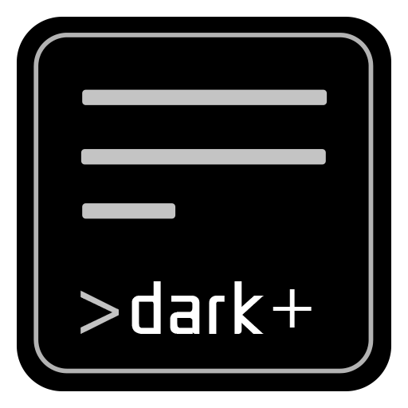

<div align="center">


---
[](https://github.com/Zuoqiu-Yingyi/siyuan-theme-dark-plus/releases/latest)
[](https://github.com/Zuoqiu-Yingyi/siyuan-theme-dark-plus/releases/latest)
[](https://github.com/Zuoqiu-Yingyi/siyuan-theme-dark-plus/blob/main/LICENSE)
[](https://github.com/Zuoqiu-Yingyi/siyuan-theme-dark-plus/commits/main)


[](https://github.com/Zuoqiu-Yingyi/siyuan-theme-dark-plus/releases)<!-- ALL-CONTRIBUTORS-BADGE:START - Do not remove or modify this section -->
[](#contributor-introduction)
<!-- ALL-CONTRIBUTORS-BADGE:END -->

---
[简体中文](./README_zh_CN.md) \| English

---
</div>

# 🌙Dark+

A dark theme (which also supports light mode, can you imagine that ~) of [SiYuan Note](https://github.com/siyuan-note/siyuan).

It is now on the shelves of the [Siyuan Notes Community Bazaar](https://github.com/siyuan-note/bazaar). If you like this theme, welcome to light up ⭐ for this project!

## **NOTICE**

**❗Some functions has been migrated to my plugins and disabled by default in this theme❗**

- **Plugin**: [Web Page View `webview`](https://github.com/Zuoqiu-Yingyi/siyuan-plugin-webview)
  - open the block or hyperlink in a new window
    - shortcut: <kbd>Middle Mouse Button</kbd>
    - SiYuan version: `v2.8.10+`
    - Dark+ Theme version: `v1.9.3+`
  - open the block in a new window and focus
    - shortcut: <kbd>Shift + Middle Mouse Button</kbd>
    - SiYuan version: `v2.8.10+`
    - Dark+ Theme version: `v1.9.3+`
- **Plugin**: [Integrated Edit Environment `monaco-editor`](https://github.com/Zuoqiu-Yingyi/siyuan-plugin-monaco-editor)
  - open the Monaco Editor in a new window to view
    - shortcut: <kbd>Alt + Middle Mouse Button</kbd>
    - SiYuan version: `v2.9.8+`
    - Dark+ Theme version: `v1.9.8+`
  - open the Monaco Editor in a new window to edit
    - shortcut: <kbd>Shift + Alt + Middle Mouse Button</kbd>
    - SiYuan version: `v2.9.8+`
    - Dark+ Theme version: `v1.9.8+`

## FEEDBACK

- Chinese
  - [Dark+ - 链滴](https://ld246.com/tag/dark%2b)
  - [Issues · Zuoqiu-Yingyi/siyuan-theme-dark-plus](https://github.com/Zuoqiu-Yingyi/siyuan-theme-dark-plus/issues)
- English
  - [Issues · Zuoqiu-Yingyi/siyuan-theme-dark-plus](https://github.com/Zuoqiu-Yingyi/siyuan-theme-dark-plus/issues)

## PREVIEW


- All inline elements are aligned when using a equal font.
- Inline element styles are adapted to all font sizes.


- When using a equal font, list indentation is 4 half-width characters (2 full-width characters).
- List indentation styles are adapted to all font sizes.

Common 2:1 monospace font for Chinese and Western languages.: `仿宋`, `黑体`, `楷体`, `隶书`, `宋体`, `新宋体`, `幼圆`

The 2:1 monospaced font in Chinese and Western characters used in the schematic diagram:
- Interface & Code block: `Sarasa Gothic Mono` [GitHub - be5invis/Sarasa-Gothic](https://github.com/be5invis/Sarasa-Gothic)
- Editor body: `LxgwWenKai Mono` [GitHub - lxgw/LxgwWenKai](https://github.com/lxgw/LxgwWenKai)


## INTRODUCTION

### CONTRIBUTOR INTRODUCTION

| Function                  | Contributor                             | Project                                                                                                                                |
| :------------------------ | :-------------------------------------- | :------------------------------------------------------------------------------------------------------------------------------------- |
| inline comments and notes | [langzhou](https://github.com/langzhou) | [siyuan-note/siyuan-comment at main · langzhou/siyuan-note · GitHub](https://github.com/langzhou/siyuan-note/tree/main/siyuan-comment) |
| list mind maps            | [royc01](https://github.com/royc01)     | [royc01/notion-theme: notion复刻](https://github.com/royc01/notion-theme)                                                              |

<!-- ALL-CONTRIBUTORS-LIST:START - Do not remove or modify this section -->
<!-- prettier-ignore-start -->
<!-- markdownlint-disable -->
<table>
  <tbody>
    <tr>
      <td align="center" valign="top" width="14.28%"><a href="https://github.com/tswwe"><br /><sub><b>thxnder</b></sub></a><br /><a href="https://github.com/Zuoqiu-Yingyi/siyuan-theme-dark-plus/commits?author=tswwe" title="Code">💻</a> <a href="https://github.com/Zuoqiu-Yingyi/siyuan-theme-dark-plus/issues?q=author%3Atswwe" title="Bug reports">🐛</a></td>
      <td align="center" valign="top" width="14.28%"><a href="https://github.com/langzhou"><br /><sub><b>langzhou</b></sub></a><br /><a href="https://github.com/Zuoqiu-Yingyi/siyuan-theme-dark-plus/commits?author=langzhou" title="Code">💻</a></td>
      <td align="center" valign="top" width="14.28%"><a href="https://github.com/royc01"><br /><sub><b>royc01</b></sub></a><br /><a href="#ideas-royc01" title="Ideas, Planning, & Feedback">🤔</a> <a href="https://github.com/Zuoqiu-Yingyi/siyuan-theme-dark-plus/commits?author=royc01" title="Code">💻</a></td>
      <td align="center" valign="top" width="14.28%"><a href="https://github.com/UserZYF"><br /><sub><b>UserZYF</b></sub></a><br /><a href="#video-UserZYF" title="Videos">📹</a></td>
      <td align="center" valign="top" width="14.28%"><a href="https://github.com/StarDustSheep"><br /><sub><b>吃星尘的羊</b></sub></a><br /><a href="#design-StarDustSheep" title="Design">🎨</a></td>
    </tr>
  </tbody>
</table>

<!-- markdownlint-restore -->
<!-- prettier-ignore-end -->

<!-- ALL-CONTRIBUTORS-LIST:END -->

PS: The table is generated automatically using [All Contributors · GitHub](https://github.com/all-contributors), go to [emoji key](https://allcontributors.org/docs/en/emoji-key) to see the contribution type.

### SHORTCUT KEYS

#### THEME SHORTCUT KEYS

| Shortcut Keys                                                                                       | Operational objectives                                                        | Function                                                                                                                                                                                                     |
| :-------------------------------------------------------------------------------------------------- | :---------------------------------------------------------------------------- | :----------------------------------------------------------------------------------------------------------------------------------------------------------------------------------------------------------- |
| <kbd>Middle Mouse Button</kbd>❗Disabled by default in the `v2.8.10+` version of SiYuan              | entire window                                                                 | open the block or hyperlink in a new window<br/>❗Migrated to plugin [Web Page View `webview`](https://github.com/Zuoqiu-Yingyi/siyuan-plugin-webview)                                                        |
| <kbd>Right Mouse Button</kbd>                                                                       | slider on the right side of the document / current reading progress indicator | jump to where the document was last browsed                                                                                                                                                                  |
| <kbd>Shift + Middle Mouse Button</kbd>❗Disabled by default in the `v2.8.10+` version of SiYuan      | entire window                                                                 | open the block in a new window and focus<br/>❗Migrated to plugin [Web Page View `webview`](https://github.com/Zuoqiu-Yingyi/siyuan-plugin-webview)                                                           |
| <kbd>Alt + Middle Mouse Button</kbd>❗Disabled by default in the `v2.9.8+` version of SiYuan         | entire window                                                                 | open the Monaco Editor in a new window and edit the content<br/>❗Migrated to plugin [Integrated Edit Environment `monaco-editor`](https://github.com/Zuoqiu-Yingyi/siyuan-plugin-monaco-editor)              |
| <kbd>Shift + Alt + Middle Mouse Button</kbd>❗Disabled by default in the `v2.9.8+` version of SiYuan | entire window                                                                 | open the Monaco Editor in a new window and edit the markdown source code<br/>❗Migrated to plugin [Integrated Edit Environment `monaco-editor`](https://github.com/Zuoqiu-Yingyi/siyuan-plugin-monaco-editor) |
| <kbd>Ctrl/⌘ + Mouse Wheel</kbd>                                                                     | entire window                                                                 | adjust the edit area font size                                                                                                                                                                               |
| <kbd>Ctrl/⌘ + Middle Mouse Button</kbd>                                                             | hyperlink                                                                     | set the custom block attributes                                                                                                                                                                              |
| <kbd>Ctrl/⌘ + Middle Mouse Button</kbd>                                                             | video block/audio block/iframe block                                          | write the current timestamp to the clipboard                                                                                                                                                                 |
| <kbd>Ctrl/⌘ + Left Mouse Button</kbd>                                                               | video block/audio block/iframe block                                          | jump to the point in time set by the custom block attribute `time`                                                                                                                                           |
| <kbd>Ctrl/⌘ + Left Mouse Button</kbd>                                                               | widget block/iframe block                                                     | reload the block contents                                                                                                                                                                                    |
| <kbd>Double-click with Left Mouse Button</kbd>                                                      | widget block/iframe block                                                     | reload the block contents                                                                                                                                                                                    |
| <kbd>Ctrl/⌘ + F1</kbd>                                                                              | current document                                                              | render the custom style for all blocks in the current document                                                                                                                                               |
| <kbd>Ctrl/⌘ + F5</kbd>                                                                              | entire window                                                                 | display block content in full screen                                                                                                                                                                         |
| <kbd>Shift + Alt + B</kbd><br/>Requires to be enabled in a custom profile                           | entire window                                                                 | turn on/off the feature of tabs are arranged vertically                                                                                                                                                      |
| <kbd>Shift + Alt + E</kbd><br/>Requires to be enabled in a custom profile                           | entire window                                                                 | turn on/off the feature of displaying the mark text                                                                                                                                                          |
| <kbd>Shift + Alt + F</kbd><br/>Requires to be enabled in a custom profile                           | entire window                                                                 | turn on/off the focus mode (collapse/expand the feature panels)                                                                                                                                              |
| <kbd>Shift + Alt + G</kbd><br/>Requires to be enabled in a custom profile                           | entire window                                                                 | turn on/off list guides (list, table list, mind map list)                                                                                                                                                    |
| <kbd>Shift + Alt + I</kbd><br/>Requires to be enabled in a custom profile                           | entire window                                                                 | turn on/off invert color mode                                                                                                                                                                                |
| <kbd>Shift + Alt + L</kbd><br/>Requires to be enabled in a custom profile                           | entire window                                                                 | turn on/off record the current browsing location                                                                                                                                                             |
| <kbd>Shift + Alt + M</kbd><br/>Requires to be enabled in a custom profile                           | entire window                                                                 | turn on/off block menu enhancement                                                                                                                                                                           |
| <kbd>Shift + Alt + N</kbd><br/>Requires to be enabled in a custom profile                           | entire window                                                                 | open the block where the cursor is located in a new window                                                                                                                                                   |
| <kbd>Shift + Alt + R</kbd><br/>Requires to be enabled in a custom profile                           | entire window                                                                 | use the web background images                                                                                                                                                                                |
| <kbd>Shift + Alt + T</kbd><br/>Requires to be enabled in a custom profile                           | entire window                                                                 | turn on/off typewriter mode                                                                                                                                                                                  |
| <kbd>Shift + Alt + C</kbd><br/>Requires to be enabled in a custom profile                           | current document                                                              | copy the full markdown text of the current document to the clipboard                                                                                                                                         |
| <kbd>Shift + Alt + X</kbd><br/>Requires to be enabled in a custom profile                           | current document                                                              | cut the full markdown text of the current document to the clipboard                                                                                                                                          |
| <kbd>Shift + Alt + D</kbd><br/>Requires to be enabled in a custom profile                           | current document                                                              | delete the full content of the current documen                                                                                                                                                               |
| <kbd>Shift + Alt + ↑</kbd><br/>Requires to be enabled in a custom profile                           | current document                                                              | collapse all sub-headings of the current document                                                                                                                                                            |
| <kbd>Shift + Alt + ↓</kbd><br/>Requires to be enabled in a custom profile                           | current document                                                              | expand all sub-headings of the current document                                                                                                                                                              |
| <kbd>Ctrl/⌘ + Shift + Alt + R</kbd><br/>Requires to be enabled in a custom profile                  | entire window                                                                 | use the custom background images                                                                                                                                                                             |
| <kbd>Ctrl/⌘ + Shift + Alt + N</kbd><br/>Requires to be enabled in a custom profile                  | entire window                                                                 | open the block and focus where the cursor is located in a new window                                                                                                                                         |
| <kbd>Ctrl/⌘ + Shift + Alt + L</kbd><br/>Requires to be enabled in a custom profile                  | entire window                                                                 | clear the current document browsing location history                                                                                                                                                         |
| <kbd>Ctrl/⌘ + Shift + Alt + O</kbd><br/>Requires to be enabled in a custom profile                  | current document                                                              | copy the current document outline as an ordered list                                                                                                                                                         |
| <kbd>Ctrl/⌘ + Shift + Alt + U</kbd><br/>Requires to be enabled in a custom profile                  | current document                                                              | copy the current document outline as an unordered list                                                                                                                                                       |
| <kbd>Ctrl/⌘ + Shift + Alt + T</kbd><br/>Requires to be enabled in a custom profile                  | current document                                                              | copy the current document outline as a task list                                                                                                                                                             |

#### EDITOR SHORTCUT KEYS

| Shortcut Keys                       | Function                  |
| :---------------------------------- | :------------------------ |
| <kbd>Alt + Z</kbd>                  | toggle word wrap          |
| <kbd>Ctrl/⌘ + Alt + P</kbd>         | window pin/unpin          |
| <kbd>Ctrl/⌘ + O</kbd>               | open file in VS Code      |
| <kbd>Ctrl/⌘ + Shift + O</kbd>       | open directory in VS Code |
| <kbd>Ctrl/⌘ + Alt + C</kbd>         | copy link                 |
| <kbd>Ctrl/⌘ + Shift + Alt + C</kbd> | copy full link            |

### CUSTOM BLOCKS ATTRIBUTES

| Operational objectives                                | Attribute Name | Attribute Value                                                                                                                                                                                                                                                                          | Function                                                         |
| :---------------------------------------------------- | :------------- | :--------------------------------------------------------------------------------------------------------------------------------------------------------------------------------------------------------------------------------------------------------------------------------------- | :--------------------------------------------------------------- |
| all types of blocks                                   | `font-family`  | `等线`<br/>`方正舒体`<br/>`方正姚体`<br/>`仿宋`<br/>`黑体`<br/>`华文彩云`<br/>`华文仿宋`<br/>`华文琥珀`<br/>`华文楷体`<br/>`华文隶书`<br/>`华文宋体`<br/>`华文细黑`<br/>`华文新魏`<br/>`华文行楷`<br/>`华文中宋`<br/>`楷体`<br/>`隶书`<br/>`宋体`<br/>`微软雅黑`<br/>`新宋体`<br/>`幼圆` | Sets the font family used by the block.                          |
| all types of blocks                                   | `render`       | `danmaku`<br/>`弹幕`<br/>(You can separate multiple attribute values with spaces)                                                                                                                                                                                                        | Set the block to the scrolling danmaku block style.              |
| all types of blocks                                   | `render`       | `scroll`<br/>`滚屏`<br/>`滚动`<br/>(You can separate multiple attribute values with spaces)                                                                                                                                                                                              | Set the vertical scroll bar for the overly long block.           |
| all types of blocks                                   | `render`       | `invert`<br/>`反色`<br/>(You can separate multiple attribute values with spaces)                                                                                                                                                                                                         | Render all images as inverted colors.                            |
| all types of blocks                                   | `mark`         | `display`<br/>`显示`<br/>(You can separate multiple attribute values with spaces)                                                                                                                                                                                                        | Display marked text.                                             |
| document blocks                                       | `location`     | block ID                                                                                                                                                                                                                                                                                 | The current document browsing location.                          |
| document blocks                                       | `auto-num-h`   | `0`<br/>`false`<br/>`禁用`<br/>`关闭`<br/>                                                                                                                                                                                                                                               | Disables automatic numbering of subheading in the document.      |
| document blocks                                       | `auto-num-f`   | `图`<br/>`图片`<br/>`Fig.`<br/>`figure`<br/>`Figure`<br/>`FIGURE`                                                                                                                                                                                                                        | Enable automatic numbering of pictures in the document.          |
| document blocks                                       | `auto-num-t`   | `表`<br/>`表格`<br/>`Tab.`<br/>`table`<br/>`Table`<br/>`TABLE`                                                                                                                                                                                                                           | Enable automatic numbering of tables in the document.            |
| document blocks                                       | `render`       | `id`<br/>(You can separate multiple attribute values with spaces)                                                                                                                                                                                                                        | Renders the ID of each block.                                    |
| document blocks                                       | `render`       | `href`<br/>(You can separate multiple attribute values with spaces)                                                                                                                                                                                                                      | Renders the URL of each hyperlink.                               |
| document blocks                                       | `render`       | `index`<br/>(You can separate multiple attribute values with spaces)                                                                                                                                                                                                                     | Renders the ordinal number of the current block in the document. |
| document blocks                                       | `render`       | `content`<br/>(You can separate multiple attribute values with spaces)                                                                                                                                                                                                                   | Renders the contents of the input box.                           |
| document blocks                                       | `render`       | `outline`<br/>(You can separate multiple attribute values with spaces)                                                                                                                                                                                                                   | Renders the outline of a hovering block.                         |
| non-document blocks                                   | `position`     | `top`<br/>`bottom`                                                                                                                                                                                                                                                                       | Pin the block to the top/bottom of the parent container.         |
| non-document blocks                                   | `style`        | CSS styles                                                                                                                                                                                                                                                                               | Set a custom style for the block.                                |
| non-document blocks                                   | `title`        | Any value                                                                                                                                                                                                                                                                                | Sets the title of the block.                                     |
| video blocks/audio blocks/widget blocks/iframe blocks | `width`        | `100%`                                                                                                                                                                                                                                                                                   | Sets the width of the iframe window to the document width.       |
| video blocks/audio blocks                             | `time`         | `ss`<br/>`ss.ms`<br/>`mm:ss`<br/>`mm:ss.ms`<br/>`hh:mm:ss`<br/>`hh:mm:ss.ms`                                                                                                                                                                                                             | Timestamp.                                                       |
| list blocks & document blocks                         | `type`         | `table`<br/>`表格`<br/>(You can separate multiple attribute values with spaces)                                                                                                                                                                                                          | Renders the list as a table.                                     |
| list blocks & document blocks                         | `type`         | `脑图`<br/>`map`<br/>`导图`<br/>`mind-map`<br/>`思维导图`<br/>(You can separate multiple attribute values with spaces)                                                                                                                                                                   | Renders the list as a mind map.                                  |
| list blocks & document blocks                         | `type`         | `看板`<br/>`board`<br/>(You can separate multiple attribute values with spaces)                                                                                                                                                                                                          | Renders the list as a board.                                     |
| table blocks                                          | `table-width`  | `auto`<br/>`自动`<br/>(You can separate multiple attribute values with spaces)                                                                                                                                                                                                           | Enable table content wraps.                                      |
| table blocks                                          | `table-width`  | `equal`<br/>`等宽`<br/>(You can separate multiple attribute values with spaces)                                                                                                                                                                                                          | Enable equal cell.                                               |
| paragraph blocks                                      | `type`         | `图标题`<br/>`表标题`<br/>`figure-title`<br/>`table-title`<br/>(You can separate multiple attribute values with spaces)                                                                                                                                                                  | Figure titles/table titles are counted automatically.            |
| paragraph blocks                                      | `writing-mode` | `horizontal-tb`<br/>`vertical-rl`<br/>`vertical-lr`<br/>`sideways-rl`<br/>`sideways-lr`                                                                                                                                                                                                  | This is shown in the following table.                            |


### FUNCTIONAL DESCRIPTION

- [Jupyter 模式 - 链滴](https://ld246.com/article/1654279855533)
- [记住当前文档浏览位置 - 链滴](https://ld246.com/article/1651720111393)
- [使用外部编辑器编辑笔记内容 - 链滴](https://ld246.com/article/1650694653631)
- [块自定义字体 - 链滴 - 链滴](https://ld246.com/article/1650339201591)
- [列表的表格视图与脑图视图 - 链滴](https://ld246.com/article/1650258401435)
- [多窗口功能 - 链滴 - 链滴](https://ld246.com/article/1649992440500)
- [使用网络背景图片 / 本地背景图片 - 链滴](https://ld246.com/article/1649386929319)
- [为笔记内 BiliBili/YouTube 视频创建时间戳 & 跳转到指定时间点 - 链滴](https://ld246.com/article/1648639553690)
- [复制当前文档的大纲至剪贴板 - 链滴](https://ld246.com/article/1648635517429)
- [为长代码块、长嵌入块与长表格添加块内滚动条 - 链滴](https://ld246.com/article/1647693571588)
- [打字机模式 - 链滴](https://ld246.com/article/1647182919087)
- [整篇文档的复制 / 剪切 (以 Markdown 格式) 与删除 - 链滴](https://ld246.com/article/1646806146533)
- [为笔记内视频块 / 音频块快速创建时间戳 - 链滴](https://ld246.com/article/1645210285263)
- [为笔记内视频块 / 音频块设置多个时间戳 - 链滴](https://ld246.com/article/1644814136903)
- [为笔记内视频块 / 音频块设置时间戳 - 链滴](https://ld246.com/article/1644759207850)

#### JUPYTER FEATURES

Note: When using the browser to access SiYuan, this feature may be blocked by the browser's security policy. Please use the desktop client to access SiYuan to use this feature.

- Add the Jupyter service's trust for Siyuan.
  1. Open file `jupyter_lab_config.py` or `jupyter_notebook_config.py`.
  2. Find `c.ServerApp.allow_origin` or `c.NotebookApp.allow_origin` field.
  3. Set the field to Siyuan `location.origin` or `*`.
     - <kbd>Ctrl + Shift + I</kbd> open Siyuan's developer tools, then enter `location.origin` in the console.
  4. Set the value of field `c.ServerApp.disable_check_xsrf` or `c.NotebookApp.disable_check_xsrf` to `True`.
  5. (Optional, Token certification scheme) Find `c.ServerApp.token` field and set it to a sufficiently secure value.
  6. Save the file and start jupyter service.
- Log in to the jupyter service.
  1. <kbd>Doc Block Menu</kbd> > <kbd>Jupyter</kbd> > <kbd>Global Settings</kbd>
  2. Open the Global Settings Window.
  3. Enter the `Service Address` and click <kbd>OK</kbd> Button.
     - `http(s)://hostname(:port)`
  4. (Optional, Cookie certification scheme) Click <kbd>Test</kbd> link to jump to the login page and sign in.
  5. (Optional, Cookie certification scheme) <kbd>Ctrl + Shift + I</kbd> open jupyter's developer tools, get `Cookies`.
     - Scheme 1: input `document.cookie` to console and copy `_xsrf` field from output.
     - Scheme 2: select a HTTP request and copy `_xsrf` field from the HTTP header field `Cookies`
     - The style of `_xsrf` field full format is `_xsrf=d|xxxxxxxx|xxxxxxxxxxxxxxxxxxxxxxxxxxxxxxxx|dddddddddd`
       - `d`: A decimal number.
       - `x`: A hexadecimal number.
  6. Close the Jupyter window and reopen the Global Settings Window.
  7. Input `Cookies` or `Token` and click <kbd>OK</kbd> button.
     - `Cookies` authentication scheme only applies if the Jupyter service is the same as the SiYuan service URL host.
       - Examples:
         - SiYuan service URL: `http://127.0.0.1:6806`
         - Jupyter service URL: `http://127.0.0.1:8888`
  8. Close the Global Settings Window.
  9.  Click <kbd>Reload the Window</kbd> button or <kbd>Ctrl + F5</kbd> to reload window.
- Establish a session.
  1. <kbd>Doc Block Menu</kbd> > <kbd>Jupyter</kbd> > <kbd>Document Settings</kbd>
  2. Open the Document Settings Window.
  3. Select a kernel and input `Session Name'` 与 `Session Path`, then click <kbd>Create</kbd> buytton.
  4. Click <kbd>Restart</kbd> button, if there is no pop-up window, the connection to the server is successful.
  5. Click <kbd>Connect</kbd> button
  6. <kbd>F5</kbd> Refresh document, if the kernel state is displayed in the upper-right corner of the document, the session is established and connected successfully.
- Run code.
  - <kbd>Code Block Menu</kbd> > <kbd>Jupyter</kbd> > <kbd>Run Code</kbd>
    - The output is rendered in Markdown format.
  - <kbd>Code Block Menu</kbd> > <kbd>Jupyter</kbd> > <kbd>Run Code (Escape Output)</kbd>
    - The output are used `\` for all symbols to escape.
- Close connection.
  - <kbd>Doc Block Menu</kbd> > <kbd>Jupyter</kbd> > <kbd>Close Connection</kbd>
    - The operate well not close session and kernel.
    - The index number of blocks well be reset.
- Close kernel.
  1. <kbd>Doc Block Menu</kbd> > <kbd>Jupyter</kbd> > <kbd>Document Settings</kbd>
  2. Click <kbd>Close</kbd> button
  3. <kbd>F5</kbd> Refresh document, if the kernel state `No Kernel` is displayed in the upper-right corner of the document, the kernel is closed successfully.

#### OTHER FEATURES

- Hyperlinks to the Siyuan Web Static File Service directory displays icons.
  -  `assets/`: Asset file directory
    - `data/**/assets/`
  -  `emojis/`: Emoji file directory
    - `data/emojis/`
  -  `plugins/`: Plugin file directory
    - `data/plugins/`
  -  `snippets/`: Snippet file directory
    - `data/snippets/`
  -  `templates/`: Template file directory
    - `data/templates/`
  -  `widgets/`: Widget file directory
    - `data/widgets/`
  -  `appearance/`: Appearance file directory
    - `conf/appearance/`
  -  `export/`: Export file directory
    - `temp/export/`
  -  `history/`: History file directory
    - `temp/history/`
- Hyperlinks to common files under the resource file directory display icons.
  - : PDF
  - : Word
  - : PowerPoint
  - : Excel
  - : Image
  - : Audio
  - : Video
  - : ZIP
  - : Other
- Hyperlinks(`URL Scheme`) to the third-party resource displays icons.
  - : `brain:` [TheBrain](https://www.thebrain.com/)
  - : `bookxnotepro:` [BookxNote Pro](https://www.bookxnotepro.com/)
  - : `calibre:` [calibre - E-book management](https://calibre-ebook.com/)
  - : `es:` [Everything](https://www.voidtools.com/)
  - : `evernote:` [Evernote](https://www.evernote.com/)
  - : `file:` [RFC 8089 - The "file" URI Scheme](https://datatracker.ietf.org/doc/html/rfc8089)
  - : `http:` [RFC 2616 - Hypertext Transfer Protocol -- HTTP/1.1](https://datatracker.ietf.org/doc/html/rfc2616/)
  - : `https:` [RFC 2818 - HTTP Over TLS](https://datatracker.ietf.org/doc/html/rfc2818)
  - : `joplin:` [Joplin](https://joplinapp.org/)
  - : `logseq:` [Logseq](https://logseq.com/)
  - : `lt:` [liquidtext](https://www.liquidtext.net/)
  - : `mailto:` [RFC 6068 - The 'mailto' URI Scheme](https://datatracker.ietf.org/doc/html/rfc6068)
  - : `marginnote3app:` [Marginnote](https://www.marginnote.com/)
  - : `obsidian:` [Obsidian](https://obsidian.md/)
  - : `onenote:` [OneNote](https://www.onenote.com/)
  - : `quicker:` [Quicker](https://getquicker.net/)
  - : `runpwsh:` `runcmd:` [url-run-command](https://github.com/Zuoqiu-Yingyi/url-run-command)
  - : `siyuan:` [思源笔记](https://b3log.org/siyuan/)
  - : `sm:` [Super Memory](https://www.super-memory.com/)
  - : `tg:` [TickTick](https://telegram.org/)
  - : `ticktick:` [TickTick](https://ticktick.com/)
  - : `vscode:` [Visual Studio Code](https://code.visualstudio.com/)
  - : `zotero:` [Zotero](https://www.zotero.org/)
    - : `zotero://open-pdf/`
- Jump from outside the browser to a specified block on the web side using the URL parameter `id=<content block ID>` (at least one tab must already be open)
  - exanple: `http(s)://host:port/stage/build/desktop/?id=20220128124308-bancmue`
- Click on a block/link/block-reference to open a new window using the <kbd>Middle Mouse Button</kbd>.
  - ❗Migrated to plugin [Web Page View `webview`](https://github.com/Zuoqiu-Yingyi/siyuan-plugin-webview).
  - ❗Disabled by default in the `v2.8.10+` version of SiYuan.
- Click on a slider on the right side of the document or current reading progress indicator to jump to where the document was last browsed using the <kbd>Right Mouse Button</kbd>.
- Click on a block/link/block-reference to open a window and focus using the <kbd>Shift + Middle Mouse Button</kbd>.
  - ❗Migrated to plugin [Web Page View `webview`](https://github.com/Zuoqiu-Yingyi/siyuan-plugin-webview).
  - ❗Disabled by default in the `v2.8.10+` version of SiYuan.
- Click on an element of the interface to open [Monaco Editor](https://github.com/microsoft/monaco-editor) in a new window and edit element's source code using the <kbd>Alt + Middle Mouse Button</kbd>.
  - ❗Migrated to plugin [Integrated Edit Environment `monaco-editor`](https://github.com/Zuoqiu-Yingyi/siyuan-plugin-monaco-editor).
  - ❗Disabled by default in the `v2.9.8+` version of SiYuan.
  - Clickable content
    - Block
      - Block `Markdown` source code
      - Only leaf blocks can be edited
    - Block Reference
      - Same as above
    - Hyperlink
      - Link target source code
      - Editable content
        - `siyuan` hyperlink target to leaf block
        - 本地文件 | local files
    - Inbox Item
      - Inbox content `Markdown` source code
      - Only view
    - History Item
      - Diff comparison view history document and current document `Markdown` source code
      - Only view
    - Snapshot Item
      - Diff comparison view two snapshot documents `Markdown` source code
      - Only view
    -  Code Snippet
      - `CSS` and `JS` code snippet source code
      - Editable
- Click on an element of the interface to open [Monaco Editor](https://github.com/microsoft/monaco-editor) in a new window and edit element's source code using the <kbd>Shift + Alt + Middle Mouse Button</kbd>.
  - ❗Migrated to plugin [Integrated Edit Environment `monaco-editor`](https://github.com/Zuoqiu-Yingyi/siyuan-plugin-monaco-editor).
  - ❗Disabled by default in the `v2.9.8+` version of SiYuan.
  - Clickable content
    - Block
      - Block `Karmdown` source code
      - Editable
    - Block Reference
      - Same as above
    - Hyperlink `siyuan://`
      - Same as above
    - History Item
      - Diff comparison edit history document and current document `Karmdown` source code
      - Editable
    - Snapshot Item
      - Diff comparison edit two snapshot documents `Karmdown` source code
      - Editable
- Use the shortcut keys <kbd>Ctrl/⌘ + Mouse Wheel</kbd> to adjust the edit area font size.
- Use hyperlinks to set block attributes.
  - `href`: A hyperlink to the block for which you want to set the block attributes.
    - example: `siyuan://blocks/20220213230830-g1amobi`
  - `title`: A set of key-value pairs in `json` format.
    - example: `{"memo": "timestamp", "custom-time": "00:00:01"}`
  - Use the shortcut keys <kbd>Ctrl/⌘ + Middle Mouse Button</kbd> click the hyperlink to set the custom block attributes.
- Use the shortcut keys <kbd>Ctrl/⌘ + Middle Mouse Button</kbd> click the video block or the audio block to write the current timestamp to the clipboard.
- Use the shortcut keys <kbd>Ctrl/⌘ + Middle Mouse Button</kbd> click the iframe block to format the point in time set by the custom block attribute `time` as a timestamp and writes it to the clipboard.
- Use the shortcut keys <kbd>Ctrl/⌘ + Left Mouse Button</kbd> click the video block, the audio block or iframe block to jump to the point in time set by the custom block attribute `time`.
- Use the shortcut keys <kbd>Ctrl/⌘ + Left Mouse Button</kbd> click the iframe block or the widget block to reload the block contents.
- Use the shortcut keys <kbd>Left Mouse Button</kbd> double-click the iframe block or the widget block to display block content in full screen.
- Use the shortcut keys <kbd>Ctrl/⌘ + F5</kbd> to reload the entire window.
- Use the shortcut keys <kbd>Shift + Alt + B</kbd> to turn on/off the feature of tabs are arranged vertically.
  - Shortcut keys need to be enabled in the custom profile.
- Use the shortcut keys <kbd>Shift + Alt + E</kbd> to turn on/off the feature of displaying the mark text.
  - Shortcut keys need to be enabled in the custom profile.
- Use the shortcut keys <kbd>Shift + Alt + F</kbd> to turn on/off the focus mode (collapse/expand the feature panels).
  - Shortcut keys need to be enabled in the custom profile.
- Use the shortcut keys <kbd>Shift + Alt + I</kbd> to turn on/off invert color mode.
  - Shortcut keys need to be enabled in the custom profile.
- Use the shortcut keys <kbd>Shift + Alt + G</kbd> to turn on/off list guides (list, table list, mind map list).
  - Shortcut keys need to be enabled in the custom profile.
- Use the shortcut keys <kbd>Shift + Alt + L</kbd> to turn on/off record the current browsing location.
  - Shortcut keys need to be enabled in the custom profile.
  - Use button <kbd>Left Mouse Button</kbd> double-click a block to record this location when turned on.
  - You can click on a slider on the right side of the document to jump to where the document was last browsed using the <kbd>Right Mouse Button</kbd> when turned on.
- Use the shortcut keys <kbd>Shift + Alt + M</kbd> to turn on/off block menu enhancement.
  - Shortcut keys need to be enabled in the custom profile.
- Use the shortcut keys <kbd>Shift + Alt + N</kbd> to open the block where the cursor is located in a new window.
  - Shortcut keys need to be enabled in the custom profile.
- Use the shortcut keys <kbd>Shift + Alt + R</kbd> to use the web background images.
  - Shortcut keys need to be enabled in the custom profile.
  - Image source: [Beautiful Free Images & Pictures | Unsplash](https://unsplash.com/)
- Use the shortcut keys <kbd>Shift + Alt + T</kbd> to turn on/off typewriter mode.
  - Shortcut keys need to be enabled in the custom profile.
- Use the shortcut keys <kbd>Shift + Alt + C</kbd> to copy the full markdown text of the current document to the clipboard.
  - Shortcut keys need to be enabled in the custom profile.
- Use the shortcut keys <kbd>Shift + Alt + X</kbd> to cut the full markdown text of the current document to the clipboard.
  - Shortcut keys need to be enabled in the custom profile.
- Use the shortcut keys <kbd>Shift + Alt + D</kbd> to delete the full content of the current documen.
  - Shortcut keys need to be enabled in the custom profile.
- Use the shortcut keys <kbd>Shift + Alt + ↑</kbd> to collapse all sub-headings of the current document.
  - Shortcut keys need to be enabled in the custom profile.
- Use the shortcut keys <kbd>Shift + Alt + ↓</kbd> to expand all sub-headings of the current document.
  - Shortcut keys need to be enabled in the custom profile.
- Use shortcut keys <kbd>Ctrl/⌘ + Shift + Alt + R</kbd> to use the custom background images.
  - Shortcut keys need to be enabled in the custom profile.
- Use shortcut keys <kbd>Ctrl/⌘ + Shift + Alt + N</kbd> to open the block where the cursor is located in a new window.
  - Shortcut keys need to be enabled in the custom profile.
- Use shortcut keys <kbd>Ctrl/⌘ + Shift + Alt + L</kbd> to clear the current document browsing location history.
  - Shortcut keys need to be enabled in the custom profile.
- Use shortcut keys <kbd>Ctrl/⌘ + Shift + Alt + O</kbd> to copy the current document outline as an ordered list.
  - Shortcut keys need to be enabled in the custom profile.
- Use shortcut keys <kbd>Ctrl/⌘ + Shift + Alt + U</kbd> to copy the current document outline as an unordered list.
  - Shortcut keys need to be enabled in the custom profile.
- Use shortcut keys <kbd>Ctrl/⌘ + Shift + Alt + T</kbd> to copy the current document outline as a task list.
  - Shortcut keys need to be enabled in the custom profile.
- Block custom attributes.
  - `font-family`: key
    - Applies to all blocks
    - font
    - Attribute value: Font name
      - `等线`
      - `方正舒体`
      - `方正姚体`
      - `仿宋`
      - `黑体`
      - `华文彩云`
      - `华文仿宋`
      - `华文琥珀`
      - `华文楷体`
      - `华文隶书`
      - `华文宋体`
      - `华文细黑`
      - `华文新魏`
      - `华文行楷`
      - `华文中宋`
      - `楷体`
      - `隶书`
      - `宋体`
      - `微软雅黑`
      - `新宋体`
      - `幼圆`
  - `render`: key
    - `danmaku` / `弹幕`: value
      - Applies to all blocks
        - If the block is a document block, set all the top-level blocks in the current document to the scrolling danmaku block style.
        - If the block is not a document block, set the current block to the scrolling danmaku block style.
      - Set the block to the scrolling danmaku block style.
    - `scroll` / `滚屏` / `滚动`: value
      - Applies to all blocks
        - If the block is a document block, add scroll bars to all the top-level blocks in the current document.
        - If the block is not a document block, add a scroll bar to the current block.
    - `invert` / `反色`: value
      - Applies to all blocks
        - If the block is a document block, render all images in the current document as inverted colors.
        - If the block is not a document block, render all images in the current block as inverted colors.
  - `mark`: key
    - `display` / `显示`: value
    - Applies to all blocks
    - Display marked text.
  - `location`: key
    - block ID: value
    - Applies to document blocks
    - Records the current document browsing location.
    - You can click on a slider on the right side of the current document to jump to where the document was last browsed using the <kbd>Right Mouse Button</kbd>.
  - `auto-num-h`: key
    - `0` / `false` / `禁用` / `关闭`: value
    - Applies to document blocks
    - isables automatic numbering of subheading in the document.
  - `auto-num-f`: key
    - `图`: value
    - `图片`: value
    - `Fig.`: value
    - `figure`: value
    - `Figure`: value
    - `FIGURE`: value
    - Applies to document blocks
    - Enable automatic numbering of pictures in the document.
  - `auto-num-t`: key
    - `表`: value
    - `表格`: value
    - `Tab.`: value
    - `table`: value
    - `Table`: value
    - `TABLE`: value
    - Applies to document blocks
    - Enable automatic numbering of tables in the document.
  - `render`: key
    - `id`: value
      - Renders the ID of each block.
    - `index`: value
      - Renders the ordinal number of the current block in the document.
    - `content`: value
      - Renders the contents of the input box.
    - `outline`: value
      - Renders the outline of a hovering block.
    - Applies to document blocks
  - `position`: key
    - `top`: value
      - Pin the block to the top of the parent container.
    - `bottom`: value
      - Pin the block to the bottom of the parent container.
  - `style`: key
    - Applies to all blocks
    - block style
    - After setting, click the <kbd>Confirm</kbd> button to set the custom attribute to a block style attribute.
  - `title`: key
    - Applies to all blocks
    - Set the block title above the block.
  - `width`: key
    - `100%`: value
      - Applies to video blocks/audio blocks/widget blocks/iframe blocks.
      - Sets the width of the iframe window to the document width.
  - `time`: key
    - `<timestamp>`: value
      - Applies to video blocks and audio blocks
      - format
        - `ss`: `ss >= 0`
        - `ss.ms`: `ss >= 0 && ms >= 0`
        - `mm:ss`: `mm >= 0 && 0 <= ss <= 59`
        - `mm:ss.ms`: `mm >= 0 && 0 <= ss <= 59 && ms >= 0`
        - `hh:mm:ss`: `hh >= 0 && 0 <= mm <= 59 && 0 <= ss <= 59`
        - `hh:mm:ss.ms`: `hh >= 0 && 0 <= mm <= 59 && 0 <= ss <= 59 && ms >= 0`
      - After you set this custom attribute in a video/audio block, clicking the video/audio block while <kbd>ctrl/⌘-down</kbd> jumps to the point in time.
  - `type`: key
    - `表格` / `title`: value
      - Applies to list blocks and document blocks
      - Renders the list as a table
      - Please insert a container block (quote block, super block) in list item when it need to lay out vertically.
      - For details, please refer to [Soil Law List Table - Yuque](https://www.yuque.com/siyuannote/docs/yev84m).
    - `脑图` / `导图` / `思维导图` / `map` / `mind-map`: value
      - Applies to list blocks and document blocks
      - Renders the list as a mind-map
      - Please insert a container block (quote block, super block) in list item when it need to lay out vertically.
    - `看板` / `board`: value
      - Applies to list blocks and document blocks
      - Renders the list as a board
    - `图标题` / `figure-title` | `表标题` / `table-title`: value
      - Applies to paragraph blocks
      - Figure titles/table titles are counted automatically
  - `table-width`: key
    - Applies to table blocks
    - Sets the table width style.
    - `auto` / `自动`: value
      - The table width automatically follows the document width.
    - `equal` / `等宽`: value
      - Cell is equal width.
  - `writing-mode`: key
    - Applies to all blocks
    - text layout mode
    - For details, please refer to [writing-mode - CSS: Cascading Style Sheets | MDN](https://developer.mozilla.org/en-US/docs/Web/CSS/writing-mode).
    - attribute value
      - `horizontal-tb`
        - For ltr scripts, content flows horizontally from left to right. For rtl scripts, content flows horizontally from right to left. The next horizontal line is positioned below the previous line.
      - `vertical-rl`
        - For ltr scripts, content flows vertically from top to bottom, and the next vertical line is positioned to the left of the previous line. For rtl scripts, content flows vertically from bottom to top, and the next vertical line is positioned to the right of the previous line.
      - `vertical-lr`
        - For ltr scripts, content flows vertically from top to bottom, and the next vertical line is positioned to the right of the previous line. For rtl scripts, content flows vertically from bottom to top, and the next vertical line is positioned to the left of the previous line.
      - `sideways-rl`
        - Only supported in Filefox.
        - For ltr scripts, content flows vertically from bottom to top. For rtl scripts, content flows vertically from top to bottom. All the glyphs, even those in vertical scripts, are set sideways toward the right.
      - `sideways-lr`
        - Only supported in Filefox.
        - For ltr scripts, content flows vertically from top to bottom. For rtl scripts, content flows vertically from bottom to top. All the glyphs, even those in vertical scripts, are set sideways toward the left.
  - Other custom attributes.
    - These styles are not loaded automatically.
    - Add the custom style name to `custom.styles` in `<workspace>/data/widgets/custom.js`.
    - Add custom style names and style values to the block's custom attributes.
    - Use the hot key <kbd>Ctrl + F1 / ⌘ + F1</kbd> to render the custom style of all current blocks.

## CUSTOM CONFIG

| Custom configuration files                  | Product                                                                                                                                                   |
| :------------------------------------------ | :-------------------------------------------------------------------------------------------------------------------------------------------------------- |
| `<workspace>/data/widgets/custom.js`        | Theme feature configuration, which overwrites the corresponding value in file `<workspace>/conf/appearance/themes/Dark+/style/module/config.js`           |
| `<workspace>/data/widgets/custom.css`       | Themes share style configuration, which overwrites the corresponding value in file `<workspace>/conf/appearance/themes/Dark+/style/module/config.css`     |
| `<workspace>/data/widgets/custom-light.css` | Theme light color style configuration, which overwrites the corresponding value in file `<workspace>/conf/appearance/themes/Dark+/style/config/light.css` |
| `<workspace>/data/widgets/custom-dark.css`  | Theme dark config style configuration, which overwrites the corresponding value in file `<workspace>/conf/appearance/themes/Dark+/style/color/dark.css`   |

### CONFIG EXAMPLE

#### `custom.js`

```js
/**
 * File Path
 *    <workspace>/data/widgets/custom.js
 * Example function:
 *    Custom background image list
 *        The directory of the light background image in the example is <workspace>/data/snippets/images/background-light
 *        The directory of the dark background image in the example is <workspace>/data/snippets/images/background-dark
 *
 *    Turn on the Copy current document full-text shortcut (Shift + Alt + C)
 */

export const config = {
    theme: {
        background: {
            image: {
                custom: {
                    random: false,
                    default: true,
                    landscape: { // Landscape background image
                      light: [
                          '/snippets/images/background-light/landscape-background-1.png',
                          '/snippets/images/background-light/landscape-background-2.png',
                          '/snippets/images/background-light/landscape-background-3.png',
                          '/snippets/images/background-light/landscape-background-4.png',
                      ],
                      dark: [
                          '/snippets/images/background-dark/landscape-background-1.png',
                          '/snippets/images/background-dark/landscape-background-2.png',
                          '/snippets/images/background-dark/landscape-background-3.png',
                          '/snippets/images/background-dark/landscape-background-4.png',
                      ],
                    },
                    portrait: { // Portrait background image
                      light: [
                          '/snippets/images/background-light/portrait-background-1.png',
                          '/snippets/images/background-light/portrait-background-2.png',
                          '/snippets/images/background-light/portrait-background-3.png',
                          '/snippets/images/background-light/portrait-background-4.png',
                      ],
                      dark: [
                          '/snippets/images/background-dark/portrait-background-1.png',
                          '/snippets/images/background-dark/portrait-background-2.png',
                          '/snippets/images/background-dark/portrait-background-3.png',
                          '/snippets/images/background-dark/portrait-background-4.png',
                      ],
                    },
                },
            },
        },
    },
}

export async function callback(config) {
    config.theme.hotkeys.doc.copy.enable = true;
}
```

For more configuration items, see [config.js](./script/module/config.js).

#### `custom.css`

```css
/**
 * File Path
 *    <workspace>/data/widgets/custom.css
 * Example function:
 *    Custom the blank line prompt text
 */

:root[data-theme-mode=light],
:root[data-theme-mode=dark] {
    /* Blank line prompt */
    --custom-empty-p: "这里是空的 (´･-･)ﾉ㊫";
    --custom-empty-c: "这里是空的 (´･-･)ﾉ↹";
    --custom-empty-t: "这里是空的 (´･-･)ﾉ☑";
    --custom-empty-u: "这里是空的 (´･-･)ﾉ◉";
    --custom-empty-o: "这里是空的 (´･-･)ﾉ①";
}

```

For more configuration items, see [config.css](./style/module/config.css).

The above example is equivalent to the following code snippet:

```css
:root[data-theme-mode=light][data-light-theme="Dark+"], 
:root[data-theme-mode=dark][data-dark-theme="Dark+"] {
    /* Blank line prompt */
    --custom-empty-p: "这里是空的 (´･-･)ﾉ㊫";
    --custom-empty-c: "这里是空的 (´･-･)ﾉ↹";
    --custom-empty-t: "这里是空的 (´･-･)ﾉ☑";
    --custom-empty-u: "这里是空的 (´･-･)ﾉ◉";
    --custom-empty-o: "这里是空的 (´･-･)ﾉ①";
}
```

Code snippets can be set in Siyuan <kbd>Settings > Appearance > Code Snippet > CSS</kbd>.

#### `custom-light.css`

```css
/**
 * File Path
 *    <workspace>/data/widgets/custom-light.css
 * Example function:
 *    Custom default light theme background image
 *        The path of the light background image in the example is
 *            <workspace>/data/widgets/background-light.png
 *            <workspace>/data/widgets/background-light-dialog.png
 */

:root[data-theme-mode=light] {
    /* default background image for light color theme */
    --custom-background-image: url("/widgets/background-light.png");

    /* default dialog background image for light color theme */
    --custom-background-image-dialog: url("/widgets/background-light-dialog.png");
}

```

For more configuration items, see [config.css](./style/module/config.css) and [light.css](./style/config/light.css).

The above example is equivalent to the following code snippet:

```css
:root[data-theme-mode=light][data-light-theme="Dark+"] {
    /* default background image for light color theme */
    --custom-background-image: url("/widgets/background-light.png");

    /* default dialog background image for light color theme */
    --custom-background-image-dialog: url("/widgets/background-light-dialog.png");
}
```

Code snippets can be set in Siyuan <kbd>Settings > Appearance > Code Snippet > CSS</kbd>.

#### `custom-dark.css`

```css
/**
 * File Path
 *    <workspace>/data/widgets/custom-dark.css
 * Example function:
 *    Custom default dark theme background image
 *        The path of the dark background image in the example is
 *            <workspace>/data/widgets/background-dark.png
 *            <workspace>/data/widgets/background-dark-dialog.png
 */

:root[data-theme-mode=dark] {
    /* default background image for dark color theme */
    --custom-background-image: url("/widgets/background-dark.png");

    /* default dialog background image for dark color theme */
    --custom-background-image-dialog: url("/widgets/background-dark-dialog.png");
}

```

For more configuration items, see [config.css](./style/module/config.css) and [dark.css](./style/config/dark.css).

The above example is equivalent to the following code snippet:

```css
:root[data-theme-mode=dark][data-dark-theme="Dark+"] {
    /* default background image for dark color theme */
    --custom-background-image: url("/widgets/background-dark.png");

    /* default dialog background image for dark color theme */
    --custom-background-image-dialog: url("/widgets/background-dark-dialog.png");
}
```

Code snippets can be set in Siyuan <kbd>Settings > Appearance > Code Snippet > CSS</kbd>.

## START

### AUTO INSTALL

The theme has been put on the shelves at [SiYuan community bazaar](https://github.com/siyuan-note/bazaar) and can be installed directly in the Bazaar.

### MANUAL INSTALL

Download the release package in [Releases](https://github.com/Zuoqiu-Yingyi/siyuan-theme-dark-plus/releases), unzip it and place it in the `<workspace>/conf/appearance/themes/` directory of SiYuan Note.

## REFERENCE & THANKS

| Author                                              | Project                                                                                                                                               | License                                                                                        |
| :-------------------------------------------------- | :---------------------------------------------------------------------------------------------------------------------------------------------------- | :--------------------------------------------------------------------------------------------- |
| **[Achuan-2](https://github.com/Achuan-2)**         | [Achuan-2/siyuan-themes-tsundoku-dark: a editor theme for siyuan note](https://github.com/Achuan-2/siyuan-themes-tsundoku-dark)                       | *[GPL-3.0 license](https://github.com/Achuan-2/siyuan-themes-tsundoku-dark/blob/main/LICENSE)* |
| **[roeseth](https://github.com/roeseth)**           | [roeseth/Siyuan-Golden-Topaz-Refined: A ported Golen Topaz theme for Siyuan note with tweaks](https://github.com/roeseth/Siyuan-Golden-Topaz-Refined) | *Unknown*                                                                                      |
| **[Morganwan90](https://github.com/Morganwan90)**   | [Morganwan90/Lightblue-siyuan-theme](https://github.com/Morganwan90/Lightblue-siyuan-theme)                                                           | *Unknown*                                                                                      |
| **[Crowds21](https://github.com/Crowds21)**         | [Crowds21/Cliff-Light](https://github.com/Crowds21/Cliff-Light)                                                                                       | *Unknown*                                                                                      |
| **[Zhangwuji](https://ld246.com/member/Zhangwuji)** | [希望能够增加根据大纲生成思维导图的功能](https://ld246.com/article/1640259008838/comment/1640304551938#:~:text=fontxiugaidark.rar)                    | *Unknown*                                                                                      |
| **[Morganwan90](https://github.com/Morganwan90)**   | [Morganwan90/Darkblue-siyuan-theme](https://github.com/Morganwan90/Darkblue-siyuan-theme)                                                             | *Unknown*                                                                                      |
| **[leolee9086](https://github.com/leolee9086)**     | [leolee9086/cc-baselib](https://github.com/leolee9086/cc-baselib)                                                                                     | *Unknown*                                                                                      |
| **[UserZYF](https://github.com/UserZYF)**           | [UserZYF/zhang-light](https://github.com/UserZYF/zhang-light)                                                                                         | *Unknown*                                                                                      |
| **[langzhou](https://github.com/langzhou)**         | [langzhou/siyuan-note](https://github.com/langzhou/siyuan-note)                                                                                       | *Unknown*                                                                                      |
| **[royc01](https://github.com/royc01)**             | [royc01/notion-theme](https://github.com/royc01/notion-theme)                                                                                         | *Unknown*                                                                                      |
| **[shawroger](https://ld246.com/member/shawroger)** | [思源笔记渲染 SQL 文档路径代码 - 链滴](https://ld246.com/article/1665129901544)                                                                       | *Unknown*                                                                                      |

ps: Sort in no particular order.

## DEPENDENCIES

| Author                                        | Project                                                               | License                                                                           |
| :-------------------------------------------- | :-------------------------------------------------------------------- | :-------------------------------------------------------------------------------- |
| **[Microsoft](https://github.com/microsoft)** | [microsoft/monaco-editor](https://github.com/microsoft/monaco-editor) | *[MIT License](https://github.com/microsoft/monaco-editor/blob/main/LICENSE.txt)* |
| **[eligrey](https://github.com/eligrey)**     | [eligrey/FileSaver.js](https://github.com/eligrey/FileSaver.js/)      | *[MIT License](https://github.com/eligrey/FileSaver.js/#readme)*                  |

ps: Sort by introduction time.

## CHANGE LOGS

[CHANGELOG](./CHANGELOG.md)

## SUPPORT & DONATE

[](https://ko-fi.com/C1C1LEIJ5)
