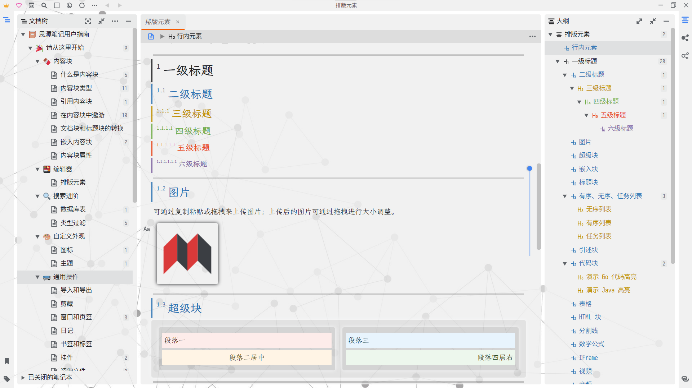
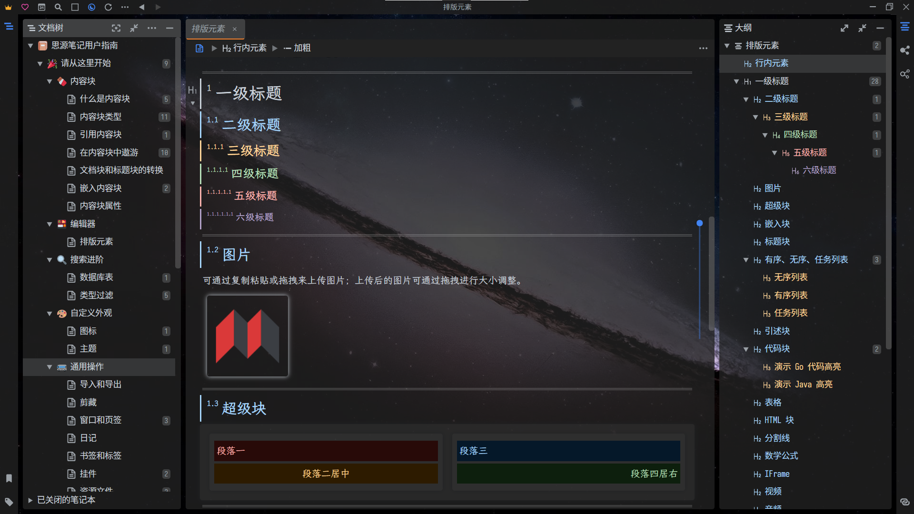
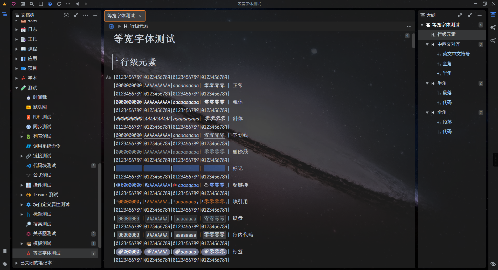
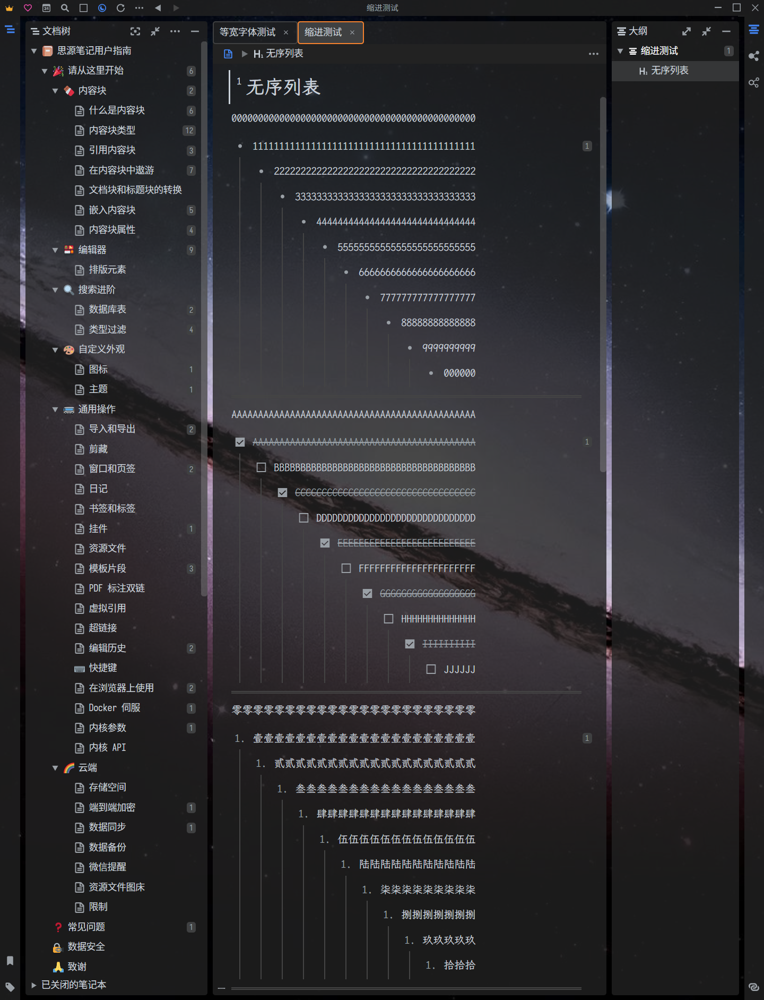

<div align="center">


---
[](https://github.com/Zuoqiu-Yingyi/siyuan-theme-dark-plus/releases/latest)
[](https://github.com/Zuoqiu-Yingyi/siyuan-theme-dark-plus/releases/latest)
[](https://github.com/Zuoqiu-Yingyi/siyuan-theme-dark-plus/blob/main/LICENSE)
[](https://github.com/Zuoqiu-Yingyi/siyuan-theme-dark-plus/commits/main)


[](https://github.com/Zuoqiu-Yingyi/siyuan-theme-dark-plus/releases)<!-- ALL-CONTRIBUTORS-BADGE:START - Do not remove or modify this section -->
[](#contributor-introduction)
<!-- ALL-CONTRIBUTORS-BADGE:END -->

---
简体中文 \| [English](./README.md)

---
</div>

# 🌙暗色+

[思源笔记](https://github.com/siyuan-note/siyuan)的一款深色主题 (同时支持浅色模式, 没想到吧~)

现已上架[思源笔记社区集市](https://github.com/siyuan-note/bazaar), 如果您喜欢本主题, 欢迎为本项目点亮一个⭐!

## **通知**

**❗已迁移到插件, 并在本主题中默认禁用的功能❗**

- **插件**: [网页视图 `webview`](https://github.com/Zuoqiu-Yingyi/siyuan-plugin-webview)
  - 在新窗口打开块或超链接
    - 快捷键: <kbd>鼠标中键</kbd>
    - 思源版本: `v2.8.10+`
    - Dark+ 主题版本: `v1.9.3+`
  - 在新窗口打开块并聚焦
    - 快捷键: <kbd>Shift + 鼠标中键</kbd>
    - 思源版本: `v2.8.10+`
    - Dark+ 主题版本: `v1.9.3+`
- **插件**: [集成编辑环境 `monaco-editor`](https://github.com/Zuoqiu-Yingyi/siyuan-plugin-monaco-editor)
  - 在新窗口打开 Monaco 编辑器以查看
    - 快捷键: <kbd>Alt + 鼠标中键</kbd>
    - 思源版本: `v2.9.8+`
    - Dark+ 主题版本: `v1.9.8+`
  - 在新窗口打开 Monaco 编辑器以编辑
    - 快捷键: <kbd>Shift + Alt 鼠标中键</kbd>
    - 思源版本: `v2.9.8+`
    - Dark+ 主题版本: `v1.9.8+`
- **插件**: [Jupyter 客户端 `jupyter-client`](https://github.com/Zuoqiu-Yingyi/siyuan-plugin-jupyter-client)
  - Jupyter 功能
    - 思源版本: `v2.10.2+`
    - Dark+ 主题版本: `v1.10.1+`

**⚠️已迁移到插件, 但仍可以在主题中使用的功能⚠️**

- **插件**: [自定义字体 `custom-fonts`](https://github.com/Zuoqiu-Yingyi/siyuan-plugin-custom-fonts)
  - 块菜单项
    - 常用字体
- **插件**: [自定义块样式 `custom-block`](https://github.com/Zuoqiu-Yingyi/siyuan-plugin-custom-block)
  - 块菜单项
    - 全屏显示
    - 列表-看板视图
    - 列表-默认视图
    - 列表-导图视图
    - 列表-表格视图
    - 显示块内容
    - 弹幕
    - 显示块 ID
    - 显示块序号
    - 显示块轮廓
    - 滚屏显示
    - 块样式
    - 表格-自动宽度
    - 表格-默认宽度
    - 表格-单元格等宽
    - 全宽显示
    - 文本排版模式
  - 块属性样式
    - 列表-看板视图
    - 列表-导图视图
    - 列表-表格视图
    - 显示块内容
    - 弹幕
    - 显示块 ID
    - 显示块序号
    - 显示块轮廓
    - 滚屏显示
    - 表格-自动宽度
    - 表格-默认宽度
    - 表格-单元格等宽
    - 全宽显示
    - 文本排版模式
- **插件**: [打字机模式 `typewriter`](https://github.com/Zuoqiu-Yingyi/siyuan-plugin-typewriter)
  - 打字机模式
  - 列表辅助线
    - 需开启插件 `焦点设置` > `显示当前焦点` 功能

## 反馈

- 中文
  - [Dark+ - 链滴](https://ld246.com/tag/dark%2b)
  - [Issues · Zuoqiu-Yingyi/siyuan-theme-dark-plus](https://github.com/Zuoqiu-Yingyi/siyuan-theme-dark-plus/issues)
- 英文
  - [Issues · Zuoqiu-Yingyi/siyuan-theme-dark-plus](https://github.com/Zuoqiu-Yingyi/siyuan-theme-dark-plus/issues)

## 预览










- 使用等宽字体时所有行内元素对齐
- 行内元素样式适配所有字号




- 使用等宽字体时列表以 4 个半宽字符(2 个全宽字符)的宽度缩进
- 列表缩进样式适配所有字号

常用中西文 2:1 等宽字体: `仿宋`, `黑体`, `楷体`, `隶书`, `宋体`, `新宋体`, `幼圆`

示意图中使用的中西文 2:1 等宽字体:
- 界面 & 代码块: `更纱黑体等宽` [GitHub - be5invis/Sarasa-Gothic](https://github.com/be5invis/Sarasa-Gothic)
- 编辑器正文: `霞鹜文楷等宽` [GitHub - lxgw/LxgwWenKai](https://github.com/lxgw/LxgwWenKai)

## 介绍 | INTRODUCTION

### CONTRIBUTOR INTRODUCTION

| 功能           | 贡献者                                  | 项目                                                                                                                                   |
| :------------- | :-------------------------------------- | :------------------------------------------------------------------------------------------------------------------------------------- |
| 行内批注与注释 | [langzhou](https://github.com/langzhou) | [siyuan-note/siyuan-comment at main · langzhou/siyuan-note · GitHub](https://github.com/langzhou/siyuan-note/tree/main/siyuan-comment) |
| 列表脑图       | [royc01](https://github.com/royc01)     | [royc01/notion-theme: notion复刻](https://github.com/royc01/notion-theme)                                                              |

<!-- ALL-CONTRIBUTORS-LIST:START - Do not remove or modify this section -->
<!-- prettier-ignore-start -->
<!-- markdownlint-disable -->
<table>
  <tbody>
    <tr>
      <td align="center" valign="top" width="14.28%"><a href="https://github.com/tswwe"><br /><sub><b>thxnder</b></sub></a><br /><a href="https://github.com/Zuoqiu-Yingyi/siyuan-theme-dark-plus/commits?author=tswwe" title="Code">💻</a> <a href="https://github.com/Zuoqiu-Yingyi/siyuan-theme-dark-plus/issues?q=author%3Atswwe" title="Bug reports">🐛</a></td>
      <td align="center" valign="top" width="14.28%"><a href="https://github.com/langzhou"><br /><sub><b>langzhou</b></sub></a><br /><a href="https://github.com/Zuoqiu-Yingyi/siyuan-theme-dark-plus/commits?author=langzhou" title="Code">💻</a></td>
      <td align="center" valign="top" width="14.28%"><a href="https://github.com/royc01"><br /><sub><b>royc01</b></sub></a><br /><a href="#ideas-royc01" title="Ideas, Planning, & Feedback">🤔</a> <a href="https://github.com/Zuoqiu-Yingyi/siyuan-theme-dark-plus/commits?author=royc01" title="Code">💻</a></td>
      <td align="center" valign="top" width="14.28%"><a href="https://github.com/UserZYF"><br /><sub><b>UserZYF</b></sub></a><br /><a href="#video-UserZYF" title="Videos">📹</a></td>
      <td align="center" valign="top" width="14.28%"><a href="https://github.com/StarDustSheep"><br /><sub><b>吃星尘的羊</b></sub></a><br /><a href="#design-StarDustSheep" title="Design">🎨</a></td>
    </tr>
  </tbody>
</table>

<!-- markdownlint-restore -->
<!-- prettier-ignore-end -->

<!-- ALL-CONTRIBUTORS-LIST:END -->

注: 该表格使用 [All Contributors · GitHub](https://github.com/all-contributors) 自动生成, 请到 [emoji key](https://allcontributors.org/docs/en/emoji-key) 查看贡献类型

### 快捷键

#### 主题快捷键

| 快捷键                                                                 | 操作对象                        | 功能                                                                                                                                                          |
| :--------------------------------------------------------------------- | :------------------------------ | :------------------------------------------------------------------------------------------------------------------------------------------------------------ |
| <kbd>鼠标中键</kbd><br/>❗在思源 `v2.8.10+` 版本中默认禁用              | 整个窗口                        | 在新窗口打开块或超链接<br/>❗已迁移至插件 [网页视图 `webview`](https://github.com/Zuoqiu-Yingyi/siyuan-plugin-webview)                                         |
| <kbd>鼠标右键</kbd>                                                    | 文档右侧滑块 / 当前阅读进度标识 | 跳转到文档上次浏览位置                                                                                                                                        |
| <kbd>Shift + 鼠标中键</kbd><br/>❗在思源 `v2.8.10+` 版本中默认禁用      | 整个窗口                        | 在新窗口打开块并聚焦<br/>❗已迁移至插件 [网页视图 `webview`](https://github.com/Zuoqiu-Yingyi/siyuan-plugin-webview)                                           |
| <kbd>Alt + 鼠标中键</kbd><br/>❗在思源 `v2.9.8+` 版本中默认禁用         | 整个窗口                        | 在新窗口打开 Monaco 编辑器并编辑单击的内容<br/>❗已迁移至插件 [集成编辑环境 `monaco-editor`](https://github.com/Zuoqiu-Yingyi/siyuan-plugin-monaco-editor)     |
| <kbd>Shift + Alt + 鼠标中键</kbd><br/>❗在思源 `v2.9.8+` 版本中默认禁用 | 整个窗口                        | 在新窗口打开 Monaco 编辑器并查看 markdown 源码<br/>❗已迁移至插件 [集成编辑环境 `monaco-editor`](https://github.com/Zuoqiu-Yingyi/siyuan-plugin-monaco-editor) |
| <kbd>Ctrl/⌘ + 鼠标滚轮</kbd><br/>❗在思源 `v2.9.8+` 版本中默认禁用      | 整个窗口                        | 调整编辑区字体大小                                                                                                                                            |
| <kbd>Ctrl/⌘ + 鼠标中键</kbd>                                           | 超链接                          | 设置自定义块属性                                                                                                                                              |
| <kbd>Ctrl/⌘ + 鼠标中键</kbd>                                           | 视频块/音频块/iframe块          | 将当前时间戳写入剪贴板                                                                                                                                        |
| <kbd>Ctrl/⌘ + 鼠标左键</kbd>                                           | 视频块/音频块/iframe块          | 跳转到自定义块属性 `time` 所设置的时间点                                                                                                                      |
| <kbd>Ctrl/⌘ + 鼠标左键</kbd>                                           | 挂件块/iframe块                 | 重新加载块内容                                                                                                                                                |
| <kbd>鼠标左键双击</kbd>                                                | 挂件块/iframe块                 | 全屏显示块内容                                                                                                                                                |
| <kbd>Ctrl/⌘ + F1</kbd><br/>需在自定义配置文件中启用                    | 当前文档                        | 渲染当前文档所有块的自定义样式                                                                                                                                |
| <kbd>Ctrl/⌘ + F5</kbd>                                                 | 整个窗口                        | 重新加载整个窗口                                                                                                                                              |
| <kbd>Shift + Alt + B</kbd><br/>需在自定义配置文件中启用                | 整个窗口                        | 启动/关闭页签纵向排列功能                                                                                                                                     |
| <kbd>Shift + Alt + E</kbd><br/>需在自定义配置文件中启用                | 整个窗口                        | 启动/关闭显示标记文本功能                                                                                                                                     |
| <kbd>Shift + Alt + F</kbd><br/>需在自定义配置文件中启用                | 整个窗口                        | 启动/关闭专注模式 (折叠/展开功能面板)                                                                                                                         |
| <kbd>Shift + Alt + G</kbd><br/>需在自定义配置文件中启用                | 整个窗口                        | 启动/关闭列表辅助线(列表, 表格列表, 思维导图列表)                                                                                                             |
| <kbd>Shift + Alt + I</kbd><br/>需在自定义配置文件中启用                | 整个窗口                        | 启动/关闭反色模式                                                                                                                                             |
| <kbd>Shift + Alt + L</kbd><br/>需在自定义配置文件中启用                | 整个窗口                        | 启动/关闭记录当前浏览位置功能                                                                                                                                 |
| <kbd>Shift + Alt + M</kbd><br/>需在自定义配置文件中启用                | 整个窗口                        | 启动/关闭块菜单增强功能                                                                                                                                       |
| <kbd>Shift + Alt + N</kbd><br/>需在自定义配置文件中启用                | 整个窗口                        | 在新窗口打开光标所在块                                                                                                                                        |
| <kbd>Shift + Alt + R</kbd><br/>需在自定义配置文件中启用                | 整个窗口                        | 使用网络背景图片                                                                                                                                              |
| <kbd>Shift + Alt + T</kbd><br/>需在自定义配置文件中启用                | 整个窗口                        | 启动/关闭打字机模式                                                                                                                                           |
| <kbd>Shift + Alt + C</kbd><br/>需在自定义配置文件中启用                | 当前文档                        | 复制当前文档 markdown 全文至剪贴板                                                                                                                            |
| <kbd>Shift + Alt + X</kbd><br/>需在自定义配置文件中启用                | 当前文档                        | 剪切当前文档 markdown 全文至剪贴板                                                                                                                            |
| <kbd>Shift + Alt + D</kbd><br/>需在自定义配置文件中启用                | 当前文档                        | 删除当前文档全文                                                                                                                                              |
| <kbd>Shift + Alt + ↑</kbd><br/>需在自定义配置文件中启用                | 当前文档                        | 折叠当前文档所有子标题                                                                                                                                        |
| <kbd>Shift + Alt + ↓</kbd><br/>需在自定义配置文件中启用                | 当前文档                        | 展开当前文档所有子标题                                                                                                                                        |
| <kbd>Ctrl/⌘ + Shift + Alt + R</kbd><br/>需在自定义配置文件中启用       | 整个窗口                        | 使用自定义背景图片                                                                                                                                            |
| <kbd>Ctrl/⌘ + Shift + Alt + N</kbd><br/>需在自定义配置文件中启用       | 整个窗口                        | 在新窗口打开光标所在块并聚焦                                                                                                                                  |
| <kbd>Ctrl/⌘ + Shift + Alt + L</kbd><br/>需在自定义配置文件中启用       | 整个窗口                        | 清除当前文档浏览位置记录                                                                                                                                      |
| <kbd>Ctrl/⌘ + Shift + Alt + O</kbd><br/>需在自定义配置文件中启用       | 当前文档                        | 复制当前文档大纲为有序列表                                                                                                                                    |
| <kbd>Ctrl/⌘ + Shift + Alt + U</kbd><br/>需在自定义配置文件中启用       | 当前文档                        | 复制当前文档大纲为无序列表                                                                                                                                    |
| <kbd>Ctrl/⌘ + Shift + Alt + T</kbd><br/>需在自定义配置文件中启用       | 当前文档                        | 复制当前文档大纲为任务列表                                                                                                                                    |

#### 编辑器快捷键

| 快捷键                              | 功能                   |
| :---------------------------------- | :--------------------- |
| <kbd>Alt + Z</kbd>                  | 切换自动换行           |
| <kbd>Ctrl/⌘ + Alt + P</kbd>         | 窗口置顶与取消置顶     |
| <kbd>Ctrl/⌘ + O</kbd>               | 在 vscode 中打开文件   |
| <kbd>Ctrl/⌘ + Shift + O</kbd>       | 在 vscode 中打开目录   |
| <kbd>Ctrl/⌘ + Alt + C</kbd>         | 复制当前窗口超链接     |
| <kbd>Ctrl/⌘ + Shift + Alt + C</kbd> | 复制当前窗口完整超链接 |

### 自定义块属性

| 操作对象                       | 属性名         | 属性值                                                                                                                                                                                                                                                                                   | 功能                             |
| :----------------------------- | :------------- | :--------------------------------------------------------------------------------------------------------------------------------------------------------------------------------------------------------------------------------------------------------------------------------------- | :------------------------------- |
| 所有块                         | `font-family`  | `等线`<br/>`方正舒体`<br/>`方正姚体`<br/>`仿宋`<br/>`黑体`<br/>`华文彩云`<br/>`华文仿宋`<br/>`华文琥珀`<br/>`华文楷体`<br/>`华文隶书`<br/>`华文宋体`<br/>`华文细黑`<br/>`华文新魏`<br/>`华文行楷`<br/>`华文中宋`<br/>`楷体`<br/>`隶书`<br/>`宋体`<br/>`微软雅黑`<br/>`新宋体`<br/>`幼圆` | 设置块所用字体族                 |
| 所有块                         | `render`       | `danmaku`<br/>`弹幕`<br/>(可使用空格分隔多个属性值)                                                                                                                                                                                                                                      | 将块设置为滚动弹幕样式           |
| 所有块                         | `render`       | `scroll`<br/>`滚屏`<br/>`滚动`<br/>(可使用空格分隔多个属性值)                                                                                                                                                                                                                            | 为过长块设置纵向滚动条           |
| 所有块                         | `render`       | `invert`<br/>`反色`<br/>(可使用空格分隔多个属性值)                                                                                                                                                                                                                                       | 将图片渲染为反色                 |
| 所有块                         | `mark`         | `display`<br/>`显示`<br/>(可使用空格分隔多个属性值)                                                                                                                                                                                                                                      | 显示标记文本                     |
| 文档块                         | `location`     | 块 ID                                                                                                                                                                                                                                                                                    | 当前文档浏览位置                 |
| 文档块                         | `auto-num-h`   | `0`<br/>`false`<br/>`禁用`<br/>`关闭`<br/>                                                                                                                                                                                                                                               | 禁用该文档子标题的自动编号       |
| 文档块                         | `auto-num-f`   | `图`<br/>`图片`<br/>`Fig.`<br/>`figure`<br/>`Figure`<br/>`FIGURE`                                                                                                                                                                                                                        | 启用该文档中图片的自动编号       |
| 文档块                         | `auto-num-t`   | `表`<br/>`表格`<br/>`Tab.`<br/>`table`<br/>`Table`<br/>`TABLE`                                                                                                                                                                                                                           | 启用该文档中表格的自动编号       |
| 文档块                         | `render`       | `id`<br/>(可使用空格分隔多个属性值)                                                                                                                                                                                                                                                      | 渲染每个块的块 ID                |
| 文档块                         | `render`       | `href`<br/>(可使用空格分隔多个属性值)                                                                                                                                                                                                                                                    | 渲染超链接的 URL                 |
| 文档块                         | `render`       | `index`<br/>(可使用空格分隔多个属性值)                                                                                                                                                                                                                                                   | 渲染当前块在文档中的序号         |
| 文档块                         | `render`       | `content`<br/>(可使用空格分隔多个属性值)                                                                                                                                                                                                                                                 | 渲染输入框中的内容               |
| 文档块                         | `render`       | `outline`<br/>(可使用空格分隔多个属性值)                                                                                                                                                                                                                                                 | 渲染鼠标悬浮的块的轮廓           |
| 非文档块                       | `position`     | `top`<br/>`bottom`                                                                                                                                                                                                                                                                       | 将块固定到父容器顶部/底部        |
| 非文档块                       | `style`        | css 样式                                                                                                                                                                                                                                                                                 | 设置块的自定义样式               |
| 非文档块                       | `title`        | 任何值                                                                                                                                                                                                                                                                                   | 设置块标题                       |
| 视频块/音频块/挂件块/iframe 块 | `width`        | `100%`                                                                                                                                                                                                                                                                                   | 将 iframe 窗口宽度设置为文档宽度 |
| 视频块/音频块                  | `time`         | `ss`<br/>`ss.ms`<br/>`mm:ss`<br/>`mm:ss.ms`<br/>`hh:mm:ss`<br/>`hh:mm:ss.ms`                                                                                                                                                                                                             | 时间戳                           |
| 列表块 & 文档块                | `type`         | `table`<br/>`表格`<br/>(可使用空格分隔多个属性值)                                                                                                                                                                                                                                        | 列表渲染为表格                   |
| 列表块 & 文档块                | `type`         | `脑图`<br/>`map`<br/>`导图`<br/>`mind-map`<br/>`思维导图`<br/>(可使用空格分隔多个属性值)                                                                                                                                                                                                 | 列表渲染为思维导图               |
| 列表块 & 文档块                | `type`         | `看板`<br/>`board`<br/>(可使用空格分隔多个属性值)                                                                                                                                                                                                                                        | 列表渲染为看板                   |
| 表格块                         | `table-width`  | `auto`<br/>`自动`<br/>(可使用空格分隔多个属性值)                                                                                                                                                                                                                                         | 启动表格内容自动换行             |
| 表格块                         | `table-width`  | `equal`<br/>`等宽`<br/>(可使用空格分隔多个属性值)                                                                                                                                                                                                                                        | 启动单元格等宽                   |
| 段落块                         | `type`         | `图标题`<br/>`表标题`<br/>`figure-title`<br/>`table-title`<br/>(可使用空格分隔多个属性值)                                                                                                                                                                                                | 图标题/表标题自动计数            |
| 段落块                         | `writing-mode` | `horizontal-tb`<br/>`vertical-rl`<br/>`vertical-lr`<br/>`sideways-rl`<br/>`sideways-lr`                                                                                                                                                                                                  | 如下表所示                       |


### 功能介绍

- [Jupyter 模式 - 链滴](https://ld246.com/article/1654279855533)
- [记住当前文档浏览位置 - 链滴](https://ld246.com/article/1651720111393)
- [使用外部编辑器编辑笔记内容 - 链滴](https://ld246.com/article/1650694653631)
- [块自定义字体 - 链滴 - 链滴](https://ld246.com/article/1650339201591)
- [列表的表格视图与脑图视图 - 链滴](https://ld246.com/article/1650258401435)
- [多窗口功能 - 链滴 - 链滴](https://ld246.com/article/1649992440500)
- [使用网络背景图片 / 本地背景图片 - 链滴](https://ld246.com/article/1649386929319)
- [为笔记内 BiliBili/YouTube 视频创建时间戳 & 跳转到指定时间点 - 链滴](https://ld246.com/article/1648639553690)
- [复制当前文档的大纲至剪贴板 - 链滴](https://ld246.com/article/1648635517429)
- [为长代码块、长嵌入块与长表格添加块内滚动条 - 链滴](https://ld246.com/article/1647693571588)
- [打字机模式 - 链滴](https://ld246.com/article/1647182919087)
- [整篇文档的复制 / 剪切 (以 Markdown 格式) 与删除 - 链滴](https://ld246.com/article/1646806146533)
- [为笔记内视频块 / 音频块快速创建时间戳 - 链滴](https://ld246.com/article/1645210285263)
- [为笔记内视频块 / 音频块设置多个时间戳 - 链滴](https://ld246.com/article/1644814136903)
- [为笔记内视频块 / 音频块设置时间戳 - 链滴](https://ld246.com/article/1644759207850)

#### 其他功能

- 指向到思源 Web 静态文件服务目录的超链接显示图标
  -  `assets/`: 资源文件目录
    - `data/**/assets/`
  -  `emojis/`: 表情文件目录
    - `data/emojis/`
  -  `plugins/`: 插件文件目录
    - `data/plugins/`
  -  `snippets/`: 片段文件目录
    - `data/snippets/`
  -  `templates/`: 模板文件目录
    - `data/templates/`
  -  `widgets/`: 挂件文件目录
    - `data/widgets/`
  -  `appearance/`: 外观文件目录
    - `conf/appearance/`
  -  `export/`: 导出文件目录
    - `temp/export/`
  -  `history/`: 历史文件目录
    - `temp/history/`
- 指向资源文件目录下常见文件的超链接显示图标
  - : PDF
  - : Word
  - : PowerPoint
  - : Excel
  - : Image
  - : Audio
  - : Video
  - : ZIP
  - : Other
- 指向第三方资源(`URL Scheme`)的超链接显示图标
  - : `brain:` [TheBrain](https://www.thebrain.com/)
  - : `bookxnotepro:` [BookxNote Pro](https://www.bookxnotepro.com/)
  - : `calibre:` [calibre - E-book management](https://calibre-ebook.com/)
  - : `es:` [Everything](https://www.voidtools.com/)
  - : `evernote:` [Evernote](https://www.evernote.com/)
  - : `file:` [RFC 8089 - The "file" URI Scheme](https://datatracker.ietf.org/doc/html/rfc8089)
  - : `http:` [RFC 2616 - Hypertext Transfer Protocol -- HTTP/1.1](https://datatracker.ietf.org/doc/html/rfc2616/)
  - : `https:` [RFC 2818 - HTTP Over TLS](https://datatracker.ietf.org/doc/html/rfc2818)
  - : `joplin:` [Joplin](https://joplinapp.org/)
  - : `logseq:` [Logseq](https://logseq.com/)
  - : `lt:` [liquidtext](https://www.liquidtext.net/)
  - : `mailto:` [RFC 6068 - The 'mailto' URI Scheme](https://datatracker.ietf.org/doc/html/rfc6068)
  - : `marginnote3app:` [Marginnote](https://www.marginnote.com/)
  - : `obsidian:` [Obsidian](https://obsidian.md/)
  - : `onenote:` [OneNote](https://www.onenote.com/)
  - : `onenote:` [OTP Auth](https://github.com/google/google-authenticator/wiki/Key-Uri-Format)
  - : `quicker:` [Quicker](https://getquicker.net/)
  - : `runpwsh:` `runcmd:` [url-run-command](https://github.com/Zuoqiu-Yingyi/url-run-command)
  - : `siyuan:` [思源笔记](https://b3log.org/siyuan/)
  - : `sm:` [Super Memory](https://www.super-memory.com/)
  - : `tg:` [TickTick](https://telegram.org/)
  - : `ticktick:` [TickTick](https://ticktick.com/)
  - : `vscode:` [Visual Studio Code](https://code.visualstudio.com/)
  - : `wsa:` [Windows Subsystem for Android](https://learn.microsoft.com/zh-cn/windows/android/wsa/)
  - : `zotero:` [Zotero](https://www.zotero.org/)
    - : `zotero://open-pdf/`
- 使用 URL 参数 `id=<内容块 ID>` 从浏览器外跳转到 Web 端的指定块(必须已经打开至少一个页签)
  - 示例: `http(s)://host:port/stage/build/desktop/?id=20220128124308-bancmue`
- 使用 <kbd>鼠标中键</kbd> 单击块/超链接/块引用在新窗口打开
  - ❗已迁移至插件 [网页视图 `webview`](https://github.com/Zuoqiu-Yingyi/siyuan-plugin-webview)
  - ❗在思源 `v2.8.10+` 版本中默认禁用
- 使用 <kbd>鼠标右键</kbd> 单击文档右侧的滑块或当前阅读进度标识, 跳转到文档上次浏览位置
- 使用 <kbd>Shift + 鼠标中键</kbd> 单击块/超链接/块引用在新窗口打开并聚焦
  - ❗已迁移至插件 [网页视图 `webview`](https://github.com/Zuoqiu-Yingyi/siyuan-plugin-webview)
  - ❗在思源 `v2.8.10+` 版本中默认禁用
- 使用 <kbd>Alt + 鼠标中键</kbd> 单击界面的元素在新窗口打开 [Monaco 编辑器](https://github.com/microsoft/monaco-editor)并编辑单击的内容的源码
  - ❗已迁移至插件 [集成编辑环境 `monaco-editor`](https://github.com/Zuoqiu-Yingyi/siyuan-plugin-monaco-editor)
  - ❗在思源 `v2.9.8+` 版本中默认禁用
  - 可点击的内容
    - 块
      - 块 `Markdown` 源码
      - 仅能编辑叶子块
    - 块引用
      - 同上
    - 超链接
      - 链接目标源码
      - 可编辑的内容
        - `siyuan` 超链接叶子块目标
        - 本地文件
    - 收集箱项
      - 收集箱内容 `Markdown` 源码
      - 仅查看
    - 历史项
      - 差异对比查看历史文档与当前文档 `Markdown` 源码document and current document `Markdown` source code
      - 仅查看
    - 快照项
      - 差异对比查看两个快照文档 `Markdown` 源码documents `Markdown` source code
      - 仅查看
    - 代码片段  Code Snippet
      - `CSS` 与 `JS` 代码片段源码
      - 可编辑
- 使用 <kbd>Shift + Alt + 鼠标中键</kbd> 单击界面的元素在新窗口打开 [Monaco 编辑器](https://github.com/microsoft/monaco-editor)并编辑单击的内容的源码
  - ❗已迁移至插件 [集成编辑环境 `monaco-editor`](https://github.com/Zuoqiu-Yingyi/siyuan-plugin-monaco-editor)
  - ❗在思源 `v2.9.8+` 版本中默认禁用
  - 可点击的内容
    - 块
      - 块 `Karmdown` 源码
      - 可编辑
    - 块引用
      - 同上
    - `siyuan://` 超链接
      - 同上
    - 历史项
      - 差异对比编辑历史文档与当前文档 `Karmdown` 源码document and current document `Karmdown` source code
      - 可编辑
    - 快照项
      - 差异对比编辑两个快照文档 `Karmdown` 源码documents `Karmdown` source code
      - 可编辑
- 使用快捷键 <kbd>Ctrl/⌘ + 鼠标滚轮</kbd> 可以调整编辑区字体大小
  - ❗思源 `v2.8.8+` 版本内置该功能
  - ❗在思源 `v2.9.8+` 版本中默认禁用
- 使用超链接设置块属性
  - `超文本引用`: 指向想要设置块属性的块的超链接
    - 示例: `siyuan://blocks/20220213230830-g1amobi`
  - `标题`: `json` 格式的一组键值对
    - 示例: `{"memo": "timestamp", "custom-time": "00:00:01"}`
  - 使用快捷键 <kbd>Ctrl/⌘ + 鼠标中键</kbd> 单击超链接设置自定义块属性
- 使用快捷键 <kbd>Ctrl/⌘ + 鼠标中键</kbd> 单击视频块/音频块将当前时间戳写入剪贴板
- 使用快捷键 <kbd>Ctrl/⌘ + 鼠标中键</kbd> 单击 iframe 块将自定义块属性 `time` 所设置的时间点格式化为时间戳并写入剪贴板
- 使用快捷键 <kbd>Ctrl/⌘ + 鼠标左键</kbd> 单击视频块/音频块/iframe 块跳转到自定义块属性 `time` 所设置的时间点
- 使用快捷键 <kbd>Ctrl/⌘ + 鼠标左键</kbd> 单击 Iframe 块或挂件块重新加载块内容
- 使用快捷键 <kbd>鼠标左键</kbd> 双击 Iframe 块或挂件块重新加载块内容
- 使用快捷键 <kbd>Ctrl/⌘ + F5</kbd> 重新加载整个窗口
- 使用快捷键 <kbd>Shift + Alt + B</kbd> 启动/关闭页签纵向排列功能
  - 需在自定义配置文件中启用快捷键
- 使用快捷键 <kbd>Shift + Alt + E</kbd> 启动/关闭显示标记文本功能
  - 需在自定义配置文件中启用快捷键
- 使用快捷键 <kbd>Shift + Alt + F</kbd> 启动/关闭专注模式 (折叠/展开功能面板)
  - 需在自定义配置文件中启用快捷键
- 使用快捷键 <kbd>Shift + Alt + I</kbd> 启动/关闭反色模式
  - 需在自定义配置文件中启用快捷键
- 使用快捷键 <kbd>Shift + Alt + G</kbd> 启动/关闭列表辅助线(列表, 表格列表, 思维导图列表)
  - 需在自定义配置文件中启用快捷键
  - 需配合插件A使用 [打字机模式 `typewriter`](https://github.com/Zuoqiu-Yingyi/siyuan-plugin-typewriter) 使用
    - 插件需开启 `焦点设置` > `显示当前焦点` 功能
- 使用快捷键 <kbd>Shift + Alt + L</kbd> 启动/关闭记录当前浏览位置功能
  - 需在自定义配置文件中启用快捷键
  - 开启后可以使用 <kbd>鼠标左键</kbd> 双击文档中的某个块以记住当前位置
  - 开启后可以使用 <kbd>鼠标右键</kbd> 单击文档右侧的滑块, 跳转到文档上次浏览位置
- 使用快捷键 <kbd>Shift + Alt + M</kbd> 启动/关闭块菜单增强功能
  - 需在自定义配置文件中启用快捷键
- 使用快捷键 <kbd>Shift + Alt + N</kbd> 在新窗口打开光标所在块
  - 需在自定义配置文件中启用快捷键
- 使用快捷键 <kbd>Shift + Alt + R</kbd> 使用网络背景图片
  - 需在自定义配置文件中启用快捷键
  - 图片来源: [Beautiful Free Images & Pictures | Unsplash](https://unsplash.com/)
- 使用快捷键 <kbd>Shift + Alt + T</kbd> 启动/关闭打字机模式
  - 需在自定义配置文件中启用快捷键
- 使用快捷键 <kbd>Shift + Alt + C</kbd> 复制当前文档 markdown 全文至剪贴板
  - 需在自定义配置文件中启用快捷键
- 使用快捷键 <kbd>Shift + Alt + X</kbd> 剪切当前文档 markdown 全文至剪贴板
  - 需在自定义配置文件中启用快捷键
- 使用快捷键 <kbd>Shift + Alt + D</kbd> 删除当前文档全部内容
  - 需在自定义配置文件中启用快捷键
- 使用快捷键 <kbd>Shift + Alt + ↑</kbd> 折叠当前文档所有子标题
  - 需在自定义配置文件中启用快捷键
- 使用快捷键 <kbd>Shift + Alt + ↓</kbd> 展开当前文档所有子标题
  - 需在自定义配置文件中启用快捷键
- 使用快捷键 <kbd>Ctrl/⌘ + Shift + Alt + R</kbd> 使用自定义背景图片
  - 需在自定义配置文件中启用快捷键
- 使用快捷键 <kbd>Ctrl/⌘ + Shift + Alt + N</kbd> 在新窗口打开光标所在块并聚焦
  - 需在自定义配置文件中启用快捷键
- 使用快捷键 <kbd>Ctrl/⌘ + Shift + Alt + L</kbd> 清除当前文档浏览位置记录
  - 需在自定义配置文件中启用快捷键
- 使用快捷键 <kbd>Ctrl/⌘ + Shift + Alt + O</kbd> 复制当前文档大纲为有序列表
  - 需在自定义配置文件中启用快捷键
- 使用快捷键 <kbd>Ctrl/⌘ + Shift + Alt + U</kbd> 复制当前文档大纲为无序列表
  - 需在自定义配置文件中启用快捷键
- 使用快捷键 <kbd>Ctrl/⌘ + Shift + Alt + T</kbd> 复制当前文档大纲为任务列表
  - 需在自定义配置文件中启用快捷键
- 块自定义属性
  - `font-family`: 属性名
    - 适用于所有块
    - 字体
    - 属性值: 字体名称
      - `等线`
      - `方正舒体`
      - `方正姚体`
      - `仿宋`
      - `黑体`
      - `华文彩云`
      - `华文仿宋`
      - `华文琥珀`
      - `华文楷体`
      - `华文隶书`
      - `华文宋体`
      - `华文细黑`
      - `华文新魏`
      - `华文行楷`
      - `华文中宋`
      - `楷体`
      - `隶书`
      - `宋体`
      - `微软雅黑`
      - `新宋体`
      - `幼圆`
  - `render`: 属性名
    - `danmaku` / `弹幕`: 属性值
      - 适用于所有块
        - 若为文档块, 将当前文档中所有最顶级的块设置为滚动弹幕样式
        - 若为非文档块, 将当前块设置为滚动弹幕样式
      - 将块设置为滚动弹幕样式
    - `scroll` / `滚屏` / `滚动`: 属性值
      - 适用于所有块
        - 若为文档块, 为当前文档中所有最顶级的块添加滚动条
        - 若为非文档块, 为当前块添加滚动条
    - `invert` / `反色`: 属性值
      - 适用于所有块
        - 若为文档块, 将当前文档中所有图片渲染为反色
        - 若为非文档块, 将当前块中所有图片渲染为反色
  - `mark`: 属性名
    - `display` / `显示`: 属性值
    - 适用于所有块
    - 显示标记文本
  - `location`: 属性名
    - 块 ID: 属性值
    - 适用于文档块
    - 记录当前文档浏览位置
    - 使用 <kbd>鼠标右键</kbd> 单击文档右侧的滑块, 可以跳转到当前文档浏览位置
  - `auto-num-h`: 属性名
    - `0` / `false` / `禁用` / `关闭`: 属性值
    - 适用于文档块
    - 禁用该文档子标题的自动编号.
  - `auto-num-f`: 属性名
    - `图`: 属性值
    - `图片`: 属性值
    - `Fig.`: 属性值
    - `figure`: 属性值
    - `Figure`: 属性值
    - `FIGURE`: 属性值
    - 适用于文档块
    - 启用该文档中图片的自动编号.
  - `auto-num-t`: 属性名
    - `表`: 属性值
    - `表格`: 属性值
    - `Tab.`: 属性值
    - `table`: 属性值
    - `Table`: 属性值
    - `TABLE`: 属性值
    - 适用于文档块
    - 启用该文档中表格的自动编号
  - `render`: 属性名
    - `id`: 属性值
      - 渲染每个块的块 ID
    - `index`: 属性值
      - 渲染当前块在文档中的序号.
    - `content`: 属性值
      - 渲染输入框中的内容
    - `outline`: 属性值
      - 渲染鼠标悬浮的块的轮廓
    - 适用于文档块
  - `position`: 属性名
    - `top`: 属性值
      - 将块固定到父容器顶部
    - `bottom`: 属性值
      - 将块固定到父容器底部
  - `style`: 属性名
    - 适用于所有块
    - 块样式
    - 设置后单击 <kbd>确认</kbd> 按钮将该自定义属性设置为块样式属性
  - `title`: 属性名
    - 适用于所有块
    - 在块的上方设置块标题
  - `width`: 属性名
    - `100%`: 属性值
      - 适用于视频块/音频块/挂件块/iframe 块
      - 将 iframe 窗口宽度设置为文档宽度
  - `time`: 属性名
    - `<时间戳>`: 属性值
      - 适用于视频块/音频块
      - 格式
        - `ss`: `ss >= 0`
        - `ss.ms`: `ss >= 0 && ms >= 0`
        - `mm:ss`: `mm >= 0 && 0 <= ss <= 59`
        - `mm:ss.ms`: `mm >= 0 && 0 <= ss <= 59 && ms >= 0`
        - `hh:mm:ss`: `hh >= 0 && 0 <= mm <= 59 && 0 <= ss <= 59`
        - `hh:mm:ss.ms`: `hh >= 0 && 0 <= mm <= 59 && 0 <= ss <= 59 && ms >= 0`
      - 在视频块/音频块中设置该自定义属性后, 按住 <kbd>Ctrl/⌘</kbd> 后单击视频/音频块可以跳转到该属性所设置的时间戳
  - `type`: 属性名
    - `表格` / `title`: 属性值
      - 适用于列表块与文档块
      - 列表渲染为表格
      - 需要在列表项内纵向排版时, 需要在列表项中插入一个容器块(引述块, 超级块)
      - 详情请参考 [土法列表表格 · 语雀](https://www.yuque.com/siyuannote/docs/yev84m)
    - `脑图` / `导图` / `思维导图` / `map` / `mind-map`: 属性值
      - 适用于列表块与文档块
      - 列表渲染为思维导图
      - 需要在列表项内纵向排版时, 需要在列表项中插入一个容器块(引述块, 超级块)
    - `看板` / `board`: 属性值
      - 适用于列表块与文档块
      - 列表渲染为看板
    - `图标题` / `figure-title` | `表标题` / `table-title`: 属性值
      - 适用于段落块
      - 图标题/表标题自动计数
  - `table-width`: 属性名
    - 适用于表格块
    - 设置表格宽度样式
    - `auto` / `自动`: 属性值
      - 表格宽度自动跟随文档宽度变化
    - `equal` / `等宽`: 属性值
      - 单元格等宽
  - `writing-mode`: 属性名
    - 适用于所有块
    - 文本排版模式
    - 详情请参考: [writing-mode - CSS（层叠样式表） | MDN](https://developer.mozilla.org/zh-CN/docs/Web/CSS/writing-mode)
    - 属性值
      - `horizontal-tb`
        - (默认)对于左对齐(ltr)文本，内容从左到右水平流动。对于右对齐(rtr)文本，内容从右到左水平流动。下一水平行位于上一行下方。
      - `vertical-rl`
        - 对于左对齐(ltr)文本，内容从上到下垂直流动，下一垂直行位于上一行左侧。对于右对齐(rtr)文本，内容从下到上垂直流动，下一垂直行位于上一行右侧。
      - `vertical-lr`
        - 对于左对齐(ltr)文本，内容从上到下垂直流动，下一垂直行位于上一行右侧。对于右对齐(rtr)文本，内容从下到上垂直流动，下一垂直行位于上一行左侧。
      - `sideways-rl`
        - 仅在 Filefox 中支持
        - 对于左对齐(ltr)文本，内容从下到上垂直流动。对于右对齐(rtr)文本，内容从上到下垂直流动。所有字形（即使是垂直文本中的字形）都朝向右侧。 (默认样式顺时针旋转 90°)
      - `sideways-lr`
        - 仅在 Filefox 中支持
        - 对于左对齐(ltr)文本，内容从上到下垂直流动。对于右对齐(rtr)文本，内容从下到上垂直流动。所有字形（即使是垂直文本中的字形）都朝向左侧。 (默认样式逆时针旋转 90°)
  - 其他自定义样式
    - 这些样式不会自动加载
    - 将自定义样式名添加到 `<工作空间>/data/widgets/custom.js` 的 `custom.styles`
    - 在块的自定义属性中添加自定义样式名与样式值
    - 使用快捷键 <kbd>Ctrl + F1 / ⌘ + F1</kbd> 渲染当前所有块的自定义样式

## 自定义配置

| 自定义配置文件                             | 说明                                                                                                |
| :----------------------------------------- | :-------------------------------------------------------------------------------------------------- |
| `<工作空间>/data/widgets/custom.js`        | 主题功能配置选项, 覆盖 `<工作空间>/conf/appearance/themes/Dark+/style/module/config.js` 中对应的值  |
| `<工作空间>/data/widgets/custom.css`       | 主题共用样式配置, 覆盖 `<工作空间>/conf/appearance/themes/Dark+/style/module/config.css` 中对应的值 |
| `<工作空间>/data/widgets/custom-light.css` | 主题浅色样式配置, 覆盖 `<工作空间>/conf/appearance/themes/Dark+/style/config/light.css` 中对应的值  |
| `<工作空间>/data/widgets/custom-dark.css`  | 主题深色样式配置, 覆盖 `<工作空间>/conf/appearance/themes/Dark+/style/config/dark.css` 中对应的值   |

### 配置示例

#### `custom.js`

```js
/**
 * 文件路径
 *    <工作空间>/data/widgets/custom.js
 * 示例功能:
 *    自定义背景图片序列
 *        示例中浅色背景图片的目录为 <工作空间>/data/snippets/images/background-light
 *        示例中深色背景图片的目录为 <工作空间>/data/snippets/images/background-dark
 *
 *    开启复制当前文档全文快捷键 (Shift + Alt + C)
 */

export const config = {
    theme: {
        background: {
            image: {
                custom: {
                    random: false,
                    default: true,
                    landscape: { // 横屏背景图片
                      light: [
                          '/snippets/images/background-light/landscape-background-1.png',
                          '/snippets/images/background-light/landscape-background-2.png',
                          '/snippets/images/background-light/landscape-background-3.png',
                          '/snippets/images/background-light/landscape-background-4.png',
                      ],
                      dark: [
                          '/snippets/images/background-dark/landscape-background-1.png',
                          '/snippets/images/background-dark/landscape-background-2.png',
                          '/snippets/images/background-dark/landscape-background-3.png',
                          '/snippets/images/background-dark/landscape-background-4.png',
                      ],
                    },
                    portrait: { // 竖屏背景图片
                      light: [
                          '/snippets/images/background-light/portrait-background-1.png',
                          '/snippets/images/background-light/portrait-background-2.png',
                          '/snippets/images/background-light/portrait-background-3.png',
                          '/snippets/images/background-light/portrait-background-4.png',
                      ],
                      dark: [
                          '/snippets/images/background-dark/portrait-background-1.png',
                          '/snippets/images/background-dark/portrait-background-2.png',
                          '/snippets/images/background-dark/portrait-background-3.png',
                          '/snippets/images/background-dark/portrait-background-4.png',
                      ],
                    },
                },
            },
        },
    },
}

export async function callback(config) {
    config.theme.hotkeys.doc.copy.enable = true;
}
```

更多配置项请参考 [config.js](./script/module/config.js)

#### `custom.css`

```css
/**
 * 文件路径
 *    <工作空间>/data/widgets/custom.css
 * 示例功能:
 *    自定义空行提示文字
 */

:root[data-theme-mode=light],
:root[data-theme-mode=dark] {
    /* 空行提示 */
    --custom-empty-p: "这里是空的 (´･-･)ﾉ㊫";
    --custom-empty-c: "这里是空的 (´･-･)ﾉ↹";
    --custom-empty-t: "这里是空的 (´･-･)ﾉ☑";
    --custom-empty-u: "这里是空的 (´･-･)ﾉ◉";
    --custom-empty-o: "这里是空的 (´･-･)ﾉ①";
}

```

更多配置项请参考 [config.css](./style/module/config.css)

上述示例等效于如下代码片段:

```css
:root[data-theme-mode=light][data-light-theme="Dark+"],
:root[data-theme-mode=dark][data-dark-theme="Dark+"] {
    /* 空行提示 */
    --custom-empty-p: "这里是空的 (´･-･)ﾉ㊫";
    --custom-empty-c: "这里是空的 (´･-･)ﾉ↹";
    --custom-empty-t: "这里是空的 (´･-･)ﾉ☑";
    --custom-empty-u: "这里是空的 (´･-･)ﾉ◉";
    --custom-empty-o: "这里是空的 (´･-･)ﾉ①";
}
```

代码片段可以在思源 <kbd>设置 > 外观 > 代码片段 > CSS</kbd> 中设置

#### `custom-light.css`

```css
/**
 * 文件路径
 *    <工作空间>/data/widgets/custom-light.css
 * 示例功能:
 *    自定义默认浅色主题背景图片
 *        示例中浅色背景图片的路径为
 *            <工作空间>/data/widgets/background-light.png
 *            <工作空间>/data/widgets/background-light-dialog.png
 */

:root[data-theme-mode=light] {
    /* 浅色主题默认背景图片 */
    --custom-background-image: url("/widgets/background-light.png");

    /* 浅色主题默认对话框背景图片 */
    --custom-background-image-dialog: url("/widgets/background-light-dialog.png");
}

```

更多配置项请参考 [config.css](./style/module/config.css) 与 [light.css](./style/config/light.css)

上述示例等效于如下代码片段:

```css
:root[data-theme-mode=light][data-light-theme="Dark+"] {
    /* 浅色主题默认背景图片 */
    --custom-background-image: url("/widgets/background-light.png");

    /* 浅色主题默认对话框背景图片 */
    --custom-background-image-dialog: url("/widgets/background-light-dialog.png");
}
```

代码片段可以在思源 <kbd>设置 > 外观 > 代码片段 > CSS</kbd> 中设置

#### `custom-dark.css`

```css
/**
 * 文件路径
 *    <工作空间>/data/widgets/custom-dark.css
 * 示例功能:
 *    自定义默认深色主题背景图片
 *        示例中深色背景图片的路径为
 *            <工作空间>/data/widgets/background-dark.png
 *            <工作空间>/data/widgets/background-dark-dialog.png
 */

:root[data-theme-mode=dark] {
    /* 深色主题默认背景图片 */
    --custom-background-image: url("/widgets/background-dark.png");

    /* 深色主题默认对话框背景图片 */
    --custom-background-image-dialog: url("/widgets/background-dark-dialog.png");
}

```

更多配置项请参考 [config.css](./style/module/config.css) 与 [dark.css](./style/config/dark.css)

上述示例等效于如下代码片段:

```css
:root[data-theme-mode=dark][data-dark-theme="Dark+"] {
    /* 深色主题默认背景图片 */
    --custom-background-image: url("/widgets/background-dark.png");

    /* 深色主题默认对话框背景图片 */
    --custom-background-image-dialog: url("/widgets/background-dark-dialog.png");
}
```

代码片段可以在思源 <kbd>设置 > 外观 > 代码片段 > CSS</kbd> 中设置

## 开始

### 自动安装

该主题已在[思源笔记社区集市](https://github.com/siyuan-note/bazaar)上架, 可直接在集市中安装

### 手动安装

在 [Releases](https://github.com/Zuoqiu-Yingyi/siyuan-theme-dark-plus/releases) 中下载发行包, 解压后放到思源笔记 `<工作空间>/conf/appearance/themes/` 目录下

## 参考 & 感谢

| 作者                                                | 项目                                                                                                                                                  | 许可证                                                                                         |
| :-------------------------------------------------- | :---------------------------------------------------------------------------------------------------------------------------------------------------- | :--------------------------------------------------------------------------------------------- |
| **[Achuan-2](https://github.com/Achuan-2)**         | [Achuan-2/siyuan-themes-tsundoku-dark: a editor theme for siyuan note](https://github.com/Achuan-2/siyuan-themes-tsundoku-dark)                       | *[GPL-3.0 license](https://github.com/Achuan-2/siyuan-themes-tsundoku-dark/blob/main/LICENSE)* |
| **[roeseth](https://github.com/roeseth)**           | [roeseth/Siyuan-Golden-Topaz-Refined: A ported Golen Topaz theme for Siyuan note with tweaks](https://github.com/roeseth/Siyuan-Golden-Topaz-Refined) | *Unknown*                                                                                      |
| **[Morganwan90](https://github.com/Morganwan90)**   | [Morganwan90/Lightblue-siyuan-theme](https://github.com/Morganwan90/Lightblue-siyuan-theme)                                                           | *Unknown*                                                                                      |
| **[Crowds21](https://github.com/Crowds21)**         | [Crowds21/Cliff-Light](https://github.com/Crowds21/Cliff-Light)                                                                                       | *Unknown*                                                                                      |
| **[Zhangwuji](https://ld246.com/member/Zhangwuji)** | [希望能够增加根据大纲生成思维导图的功能](https://ld246.com/article/1640259008838/comment/1640304551938#:~:text=fontxiugaidark.rar)                    | *Unknown*                                                                                      |
| **[Morganwan90](https://github.com/Morganwan90)**   | [Morganwan90/Darkblue-siyuan-theme](https://github.com/Morganwan90/Darkblue-siyuan-theme)                                                             | *Unknown*                                                                                      |
| **[leolee9086](https://github.com/leolee9086)**     | [leolee9086/cc-baselib](https://github.com/leolee9086/cc-baselib)                                                                                     | *Unknown*                                                                                      |
| **[UserZYF](https://github.com/UserZYF)**           | [UserZYF/zhang-light](https://github.com/UserZYF/zhang-light)                                                                                         | *Unknown*                                                                                      |
| **[langzhou](https://github.com/langzhou)**         | [langzhou/siyuan-note](https://github.com/langzhou/siyuan-note)                                                                                       | *Unknown*                                                                                      |
| **[royc01](https://github.com/royc01)**             | [royc01/notion-theme](https://github.com/royc01/notion-theme)                                                                                         | *Unknown*                                                                                      |
| **[shawroger](https://ld246.com/member/shawroger)** | [思源笔记渲染 SQL 文档路径代码 - 链滴](https://ld246.com/article/1665129901544)                                                                       | *Unknown*                                                                                      |

注: 排序不分先后

## 依赖

| 作者                                          | 项目                                                                  | 许可证                                                                            |
| :-------------------------------------------- | :-------------------------------------------------------------------- | :-------------------------------------------------------------------------------- |
| **[Microsoft](https://github.com/microsoft)** | [microsoft/monaco-editor](https://github.com/microsoft/monaco-editor) | *[MIT License](https://github.com/microsoft/monaco-editor/blob/main/LICENSE.txt)* |
| **[eligrey](https://github.com/eligrey)**     | [eligrey/FileSaver.js](https://github.com/eligrey/FileSaver.js/)      | *[MIT License](https://github.com/eligrey/FileSaver.js/#readme)*                  |

注: 按引入时间排序

## 更改日志

[CHANGELOG](./CHANGELOG.md)

## 支持 & 捐助

[](https://afdian.net/a/zuoqiu?tab=sponsor)
